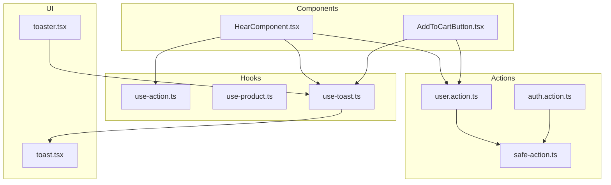
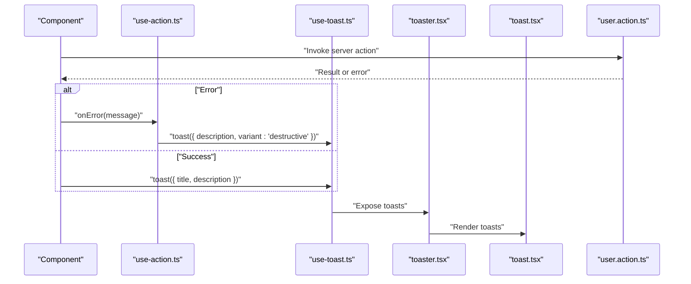
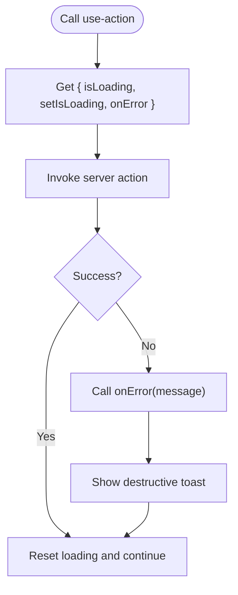
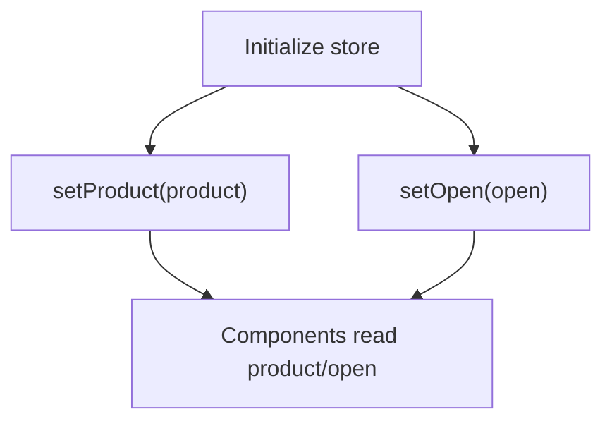
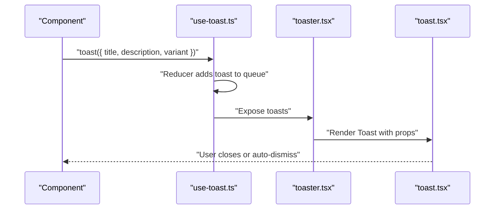
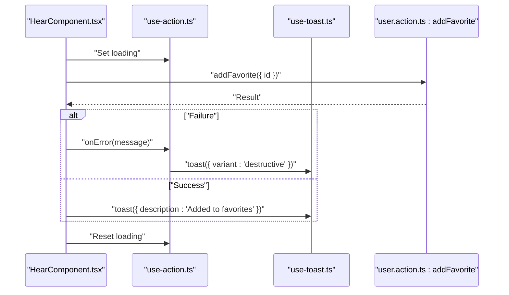
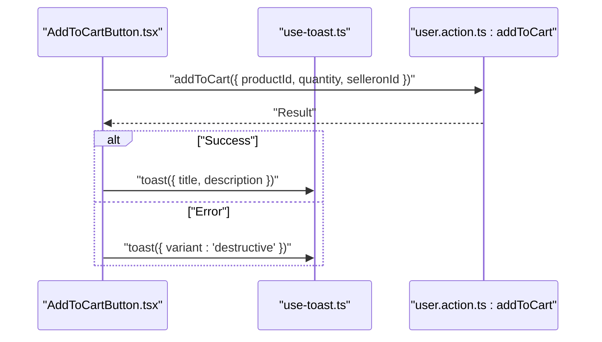
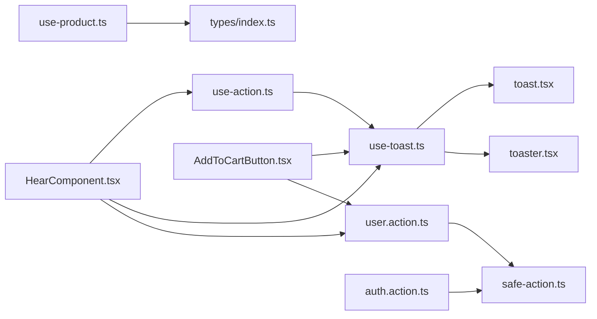

# Custom Hooks

<cite>
**Referenced Files in This Document**
- [use-action.ts](file://hooks/use-action.ts)
- [use-product.ts](file://hooks/use-product.ts)
- [use-toast.ts](file://hooks/use-toast.ts)
- [toast.tsx](file://components/ui/toast.tsx)
- [toaster.tsx](file://components/ui/toaster.tsx)
- [HearComponent.tsx](file://app/(root)/_components/HearComponent.tsx)
- [AddToCartButton.tsx](file://app/(root)/product/_components/AddToCartButton.tsx)
- [user.action.ts](file://actions/user.action.ts)
- [auth.action.ts](file://actions/auth.action.ts)
- [safe-action.ts](file://lib/safe-action.ts)
- [index.ts](file://types/index.ts)
</cite>

## Table of Contents
1. [Introduction](#introduction)
2. [Project Structure](#project-structure)
3. [Core Components](#core-components)
4. [Architecture Overview](#architecture-overview)
5. [Detailed Component Analysis](#detailed-component-analysis)
6. [Dependency Analysis](#dependency-analysis)
7. [Performance Considerations](#performance-considerations)
8. [Troubleshooting Guide](#troubleshooting-guide)
9. [Conclusion](#conclusion)
10. [Appendices](#appendices)

## Introduction
This document explains Optim Bozor’s custom React hooks that encapsulate business logic and state management:
- use-action: A small hook that centralizes loading state and standardized error notifications during server actions.
- use-product: A Zustand-backed store for product-related UI state (selected product and modal open state).
- use-toast: A toast notification system inspired by react-hot-toast, integrated with Radix UI primitives and a Toaster component.

It covers parameters, return values, usage patterns, integration examples, composition patterns, dependency management, performance optimizations, and extension guidelines.

## Project Structure
The hooks live under the hooks directory and integrate with UI components and server actions:
- hooks/use-action.ts and hooks/use-product.ts are client-side hooks.
- hooks/use-toast.ts is a client-side toast manager with a Toaster UI component in components/ui/toaster.tsx and primitive toast components in components/ui/toast.tsx.
- Server actions in actions/user.action.ts and actions/auth.action.ts are invoked by components and can trigger notifications via use-toast.

**Diagram sources**
- [use-action.ts](file://hooks/use-action.ts)
- [use-product.ts](file://hooks/use-product.ts)
- [use-toast.ts](file://hooks/use-toast.ts)
- [toast.tsx](file://components/ui/toast.tsx)
- [toaster.tsx](file://components/ui/toaster.tsx)
- [HearComponent.tsx](file://app/(root)/_components/HearComponent.tsx)
- [AddToCartButton.tsx](file://app/(root)/product/_components/AddToCartButton.tsx)
- [user.action.ts](file://actions/user.action.ts)
- [auth.action.ts](file://actions/auth.action.ts)
- [safe-action.ts](file://lib/safe-action.ts)

**Section sources**
- [use-action.ts](file://hooks/use-action.ts)
- [use-product.ts](file://hooks/use-product.ts)
- [use-toast.ts](file://hooks/use-toast.ts)
- [toast.tsx](file://components/ui/toast.tsx)
- [toaster.tsx](file://components/ui/toaster.tsx)
- [HearComponent.tsx](file://app/(root)/_components/HearComponent.tsx)
- [AddToCartButton.tsx](file://app/(root)/product/_components/AddToCartButton.tsx)
- [user.action.ts](file://actions/user.action.ts)
- [auth.action.ts](file://actions/auth.action.ts)
- [safe-action.ts](file://lib/safe-action.ts)

## Core Components
- use-action
  - Purpose: Provide a shared loading state and a centralized onError handler that triggers a destructive toast.
  - Returns: { isLoading: boolean, setIsLoading: Setter, onError: (message: string) => void }
  - Typical usage: Wrap server action invocations to toggle loading and surface errors consistently.
- use-product
  - Purpose: Zustand store for product UI state (selected product and modal open flag).
  - Returns: Store-bound getters/setters for product and open state.
  - Typical usage: Manage selected product and whether a product modal is visible.
- use-toast
  - Purpose: Global toast notifications with a reducer-based state machine and imperative toast() function.
  - Returns: useToast(): { toasts: Toast[], toast(props), dismiss(id?) }
  - Typical usage: Call toast({ title, description, variant }) from components after async operations.

**Section sources**
- [use-action.ts](file://hooks/use-action.ts)
- [use-product.ts](file://hooks/use-product.ts)
- [use-toast.ts](file://hooks/use-toast.ts)

## Architecture Overview
The hooks integrate with components and server actions as follows:
- Components call server actions (e.g., adding favorites or adding to cart).
- On error, components either use use-action.onError or call use-toast imperatively.
- use-toast coordinates with Radix UI toast primitives via components/ui/toast.tsx and renders them via components/ui/toaster.tsx.

**Diagram sources**
- [use-action.ts](file://hooks/use-action.ts)
- [use-toast.ts](file://hooks/use-toast.ts)
- [toaster.tsx](file://components/ui/toaster.tsx)
- [toast.tsx](file://components/ui/toast.tsx)
- [user.action.ts](file://actions/user.action.ts)

## Detailed Component Analysis

### use-action Hook
- Parameters: None (no inputs).
- Returns:
  - isLoading: boolean
  - setIsLoading: (value: boolean) => void
  - onError: (message: string) => void
- Behavior:
  - Manages local loading state.
  - onError toggles loading off and displays a destructive toast via the shared toast utility.
- Usage pattern:
  - Set loading before invoking a server action.
  - On failure, call onError with a user-friendly message.
  - Ensure loading is reset in finally blocks or after response handling.

**Diagram sources**
- [use-action.ts](file://hooks/use-action.ts)

**Section sources**
- [use-action.ts](file://hooks/use-action.ts)

### use-product Hook
- Parameters: None (store initialization).
- Returns: Zustand store with:
  - product: IProduct1 | null
  - setProduct: (product: IProduct1 | null) => void
  - open: boolean
  - setOpen: (open: boolean) => void
- Behavior:
  - Maintains product selection and modal visibility state.
  - Uses Zustand’s functional updates to change state.
- Usage pattern:
  - Initialize with null product and closed modal.
  - Update product and open state when a product is selected or a modal opens.

**Diagram sources**
- [use-product.ts](file://hooks/use-product.ts)
- [index.ts](file://types/index.ts)

**Section sources**
- [use-product.ts](file://hooks/use-product.ts)
- [index.ts](file://types/index.ts)

### use-toast Hook
- Parameters: None (imperative usage).
- Returns:
  - useToast(): { toasts: Toast[], toast(props), dismiss(id?) }
  - toast(props): { id, dismiss(), update(props) }
- Behavior:
  - Maintains a reducer-driven toast queue with a cap (TOAST_LIMIT).
  - Auto-dismisses toasts after a long delay and supports manual dismissal.
  - Integrates with Radix UI toast primitives via components/ui/toast.tsx.
- Usage pattern:
  - Imperatively call toast({ title, description, variant }) after successful operations.
  - Optionally call dismiss(id) or update(id) to manage individual toasts.

**Diagram sources**
- [use-toast.ts](file://hooks/use-toast.ts)
- [toaster.tsx](file://components/ui/toaster.tsx)
- [toast.tsx](file://components/ui/toast.tsx)

**Section sources**
- [use-toast.ts](file://hooks/use-toast.ts)
- [toaster.tsx](file://components/ui/toaster.tsx)
- [toast.tsx](file://components/ui/toast.tsx)

### Integration Examples

#### Favorite Toggle with use-action and use-toast
- Component: app/(root)/_components/HearComponent.tsx
- Pattern:
  - Destructure isLoading, setIsLoading, onError from use-action.
  - On success, call toast with a success message.
  - On error, call onError to show a destructive toast.
  - Toggle loading state around server action invocation.

**Diagram sources**
- [HearComponent.tsx](file://app/(root)/_components/HearComponent.tsx)
- [use-action.ts](file://hooks/use-action.ts)
- [use-toast.ts](file://hooks/use-toast.ts)
- [user.action.ts](file://actions/user.action.ts)

**Section sources**
- [HearComponent.tsx](file://app/(root)/_components/HearComponent.tsx)
- [use-action.ts](file://hooks/use-action.ts)
- [use-toast.ts](file://hooks/use-toast.ts)
- [user.action.ts](file://actions/user.action.ts)

#### Add to Cart with use-toast
- Component: app/(root)/product/_components/AddToCartButton.tsx
- Pattern:
  - Imperatively call toast({ title, description }) on success.
  - Call toast with variant 'destructive' on error.
  - Refresh page state after successful operation.

**Diagram sources**
- [AddToCartButton.tsx](file://app/(root)/product/_components/AddToCartButton.tsx)
- [use-toast.ts](file://hooks/use-toast.ts)
- [user.action.ts](file://actions/user.action.ts)

**Section sources**
- [AddToCartButton.tsx](file://app/(root)/product/_components/AddToCartButton.tsx)
- [use-toast.ts](file://hooks/use-toast.ts)
- [user.action.ts](file://actions/user.action.ts)

## Dependency Analysis
- use-action depends on:
  - use-toast for error notifications.
- use-product depends on:
  - Zustand for state management.
  - types/index.ts for IProduct1 shape.
- use-toast depends on:
  - components/ui/toast.tsx for Radix UI primitives.
  - components/ui/toaster.tsx for rendering.
- Components depend on:
  - actions/user.action.ts and actions/auth.action.ts for server logic.
  - lib/safe-action.ts for typed server actions.

**Diagram sources**
- [use-action.ts](file://hooks/use-action.ts)
- [use-product.ts](file://hooks/use-product.ts)
- [use-toast.ts](file://hooks/use-toast.ts)
- [toast.tsx](file://components/ui/toast.tsx)
- [toaster.tsx](file://components/ui/toaster.tsx)
- [HearComponent.tsx](file://app/(root)/_components/HearComponent.tsx)
- [AddToCartButton.tsx](file://app/(root)/product/_components/AddToCartButton.tsx)
- [user.action.ts](file://actions/user.action.ts)
- [auth.action.ts](file://actions/auth.action.ts)
- [safe-action.ts](file://lib/safe-action.ts)
- [index.ts](file://types/index.ts)

**Section sources**
- [use-action.ts](file://hooks/use-action.ts)
- [use-product.ts](file://hooks/use-product.ts)
- [use-toast.ts](file://hooks/use-toast.ts)
- [toast.tsx](file://components/ui/toast.tsx)
- [toaster.tsx](file://components/ui/toaster.tsx)
- [HearComponent.tsx](file://app/(root)/_components/HearComponent.tsx)
- [AddToCartButton.tsx](file://app/(root)/product/_components/AddToCartButton.tsx)
- [user.action.ts](file://actions/user.action.ts)
- [auth.action.ts](file://actions/auth.action.ts)
- [safe-action.ts](file://lib/safe-action.ts)
- [index.ts](file://types/index.ts)

## Performance Considerations
- use-toast
  - Queue limit: TOAST_LIMIT prevents unbounded growth of toasts.
  - Auto-dismiss: Long timeout avoids manual cleanup pressure; dismissible via ID.
  - Single reducer state: Efficient updates via immutable copies and targeted updates.
- use-action
  - Minimal state footprint: Only loading and error reporting.
  - Centralized error UX: Reduces duplication across components.
- use-product
  - Zustand store: Lightweight and efficient for small UI state slices.
  - Functional updates: Avoids unnecessary re-renders by updating only changed fields.

[No sources needed since this section provides general guidance]

## Troubleshooting Guide
- Toasts not appearing
  - Ensure Toaster is mounted in the app shell and useToast is called inside a client component.
  - Verify components/ui/toaster.tsx is included in the app tree.
- Duplicate or excessive toasts
  - Confirm TOAST_LIMIT and dismissal logic are intact; avoid calling toast repeatedly without IDs.
- Error notifications not shown
  - For use-action.onError, ensure it is called on failures and that use-toast is imported and initialized.
- Server action errors
  - Components should check for serverError or validationErrors and call onError or toast appropriately.
- Zustand store not updating
  - Ensure setProduct and setOpen are called with correct types matching IProduct1 and boolean respectively.

**Section sources**
- [use-toast.ts](file://hooks/use-toast.ts)
- [toaster.tsx](file://components/ui/toaster.tsx)
- [use-action.ts](file://hooks/use-action.ts)
- [user.action.ts](file://actions/user.action.ts)
- [index.ts](file://types/index.ts)

## Conclusion
These hooks provide a cohesive, reusable foundation for state and notifications:
- use-action standardizes async error handling and loading feedback.
- use-product encapsulates product UI state with a minimal, composable store.
- use-toast delivers a robust, imperative notification system integrated with Radix UI.

They are designed for easy composition, predictable behavior, and straightforward extension.

[No sources needed since this section summarizes without analyzing specific files]

## Appendices

### Hook Composition Patterns
- Prefer composing use-action with use-toast for consistent error UX.
- Use use-product to decouple product selection from UI components.
- Keep imperative toast calls localized to where async operations resolve.

[No sources needed since this section provides general guidance]

### Extending the Hooks
- use-action
  - Add optional callbacks for success/error to reduce duplication.
  - Introduce retry logic or debounced loading states if needed.
- use-product
  - Expand the store with additional UI flags (e.g., modal size, filters).
  - Add selectors for derived state (e.g., isModalVisible).
- use-toast
  - Add toast presets (e.g., success, warning) to simplify calls.
  - Support grouping or stacking toasts for batch updates.

[No sources needed since this section provides general guidance]