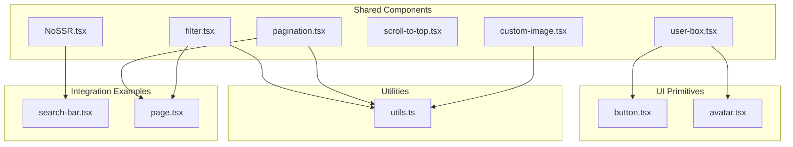
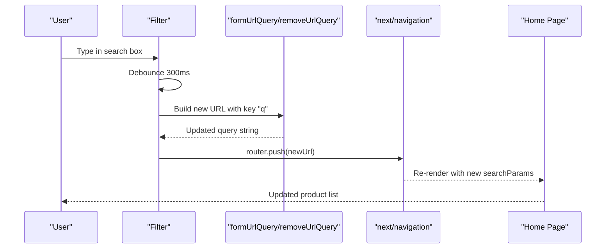
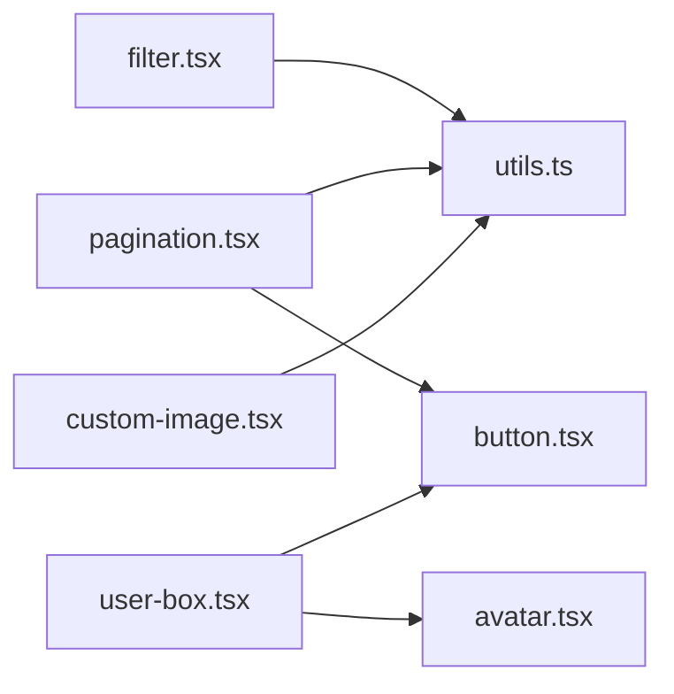

# Shared Components

<cite>
**Referenced Files in This Document**
- [NoSSR.tsx](file://components/shared/NoSSR.tsx)
- [filter.tsx](file://components/shared/filter.tsx)
- [pagination.tsx](file://components/shared/pagination.tsx)
- [scroll-to-top.tsx](file://components/shared/scroll-to-top.tsx)
- [user-box.tsx](file://components/shared/user-box.tsx)
- [custom-image.tsx](file://components/shared/custom-image.tsx)
- [utils.ts](file://lib/utils.ts)
- [button.tsx](file://components/ui/button.tsx)
- [avatar.tsx](file://components/ui/avatar.tsx)
- [search-bar.tsx](file://app/(root)/_components/search-bar.tsx)
- [page.tsx](file://app/(root)/(home)/page.tsx)
</cite>

## Table of Contents
1. [Introduction](#introduction)
2. [Project Structure](#project-structure)
3. [Core Components](#core-components)
4. [Architecture Overview](#architecture-overview)
5. [Detailed Component Analysis](#detailed-component-analysis)
6. [Dependency Analysis](#dependency-analysis)
7. [Performance Considerations](#performance-considerations)
8. [Troubleshooting Guide](#troubleshooting-guide)
9. [Conclusion](#conclusion)

## Introduction
This document describes Optim Bozor’s shared utility components that provide common functionality across the application. It covers:
- NoSSR for client-side rendering optimization
- Filter for product search
- Pagination for data navigation
- Scroll-to-top for UX enhancement
- UserBox for profile display and logout
- CustomImage for optimized image handling

Each component’s implementation, props, usage patterns, SSR considerations, responsiveness, and performance optimizations are explained with references to the actual source files.

## Project Structure
The shared components live under components/shared and integrate with UI primitives from components/ui and utility helpers from lib/utils. Typical integration patterns include:
- Wrapping third-party libraries that rely on browser APIs with NoSSR
- Using Filter and Pagination to manage URL query state for product browsing
- Rendering images with CustomImage for lazy loading and smooth transitions
- Presenting user profiles with UserBox and enabling scroll-to-top affordances

**Diagram sources**
- [NoSSR.tsx:1-16](file://components/shared/NoSSR.tsx#L1-L16)
- [filter.tsx:1-49](file://components/shared/filter.tsx#L1-L49)
- [pagination.tsx:1-57](file://components/shared/pagination.tsx#L1-L57)
- [scroll-to-top.tsx:1-51](file://components/shared/scroll-to-top.tsx#L1-L51)
- [user-box.tsx:1-117](file://components/shared/user-box.tsx#L1-L117)
- [custom-image.tsx:1-32](file://components/shared/custom-image.tsx#L1-L32)
- [utils.ts:1-73](file://lib/utils.ts#L1-L73)
- [button.tsx:1-73](file://components/ui/button.tsx#L1-L73)
- [avatar.tsx:1-51](file://components/ui/avatar.tsx#L1-L51)
- [search-bar.tsx](file://app/(root)/_components/search-bar.tsx#L1-L40)
- [page.tsx](file://app/(root)/(home)/page.tsx#L1-L58)

**Section sources**
- [NoSSR.tsx:1-16](file://components/shared/NoSSR.tsx#L1-L16)
- [filter.tsx:1-49](file://components/shared/filter.tsx#L1-L49)
- [pagination.tsx:1-57](file://components/shared/pagination.tsx#L1-L57)
- [scroll-to-top.tsx:1-51](file://components/shared/scroll-to-top.tsx#L1-L51)
- [user-box.tsx:1-117](file://components/shared/user-box.tsx#L1-L117)
- [custom-image.tsx:1-32](file://components/shared/custom-image.tsx#L1-L32)
- [utils.ts:1-73](file://lib/utils.ts#L1-L73)
- [button.tsx:1-73](file://components/ui/button.tsx#L1-L73)
- [avatar.tsx:1-51](file://components/ui/avatar.tsx#L1-L51)
- [search-bar.tsx](file://app/(root)/_components/search-bar.tsx#L1-L40)
- [page.tsx](file://app/(root)/(home)/page.tsx#L1-L58)

## Core Components
- NoSSR: Dynamic import wrapper disabling SSR for components relying on browser globals.
- Filter: Debounced URL-driven search input that updates query parameters without full reload.
- Pagination: Client-side navigation that updates the page query param and disables scroll restoration.
- Scroll-to-top: Floating button that appears after scrolling down and smoothly scrolls to top.
- UserBox: Profile dropdown with avatar fallback, links to dashboard/settings, and logout confirmation.
- CustomImage: Next/Image wrapper with loading state, priority, and smooth transition effects.

**Section sources**
- [NoSSR.tsx:1-16](file://components/shared/NoSSR.tsx#L1-L16)
- [filter.tsx:1-49](file://components/shared/filter.tsx#L1-L49)
- [pagination.tsx:1-57](file://components/shared/pagination.tsx#L1-L57)
- [scroll-to-top.tsx:1-51](file://components/shared/scroll-to-top.tsx#L1-L51)
- [user-box.tsx:1-117](file://components/shared/user-box.tsx#L1-L117)
- [custom-image.tsx:1-32](file://components/shared/custom-image.tsx#L1-L32)

## Architecture Overview
The shared components coordinate around three pillars:
- URL state management via query parameters
- Client-side interactivity with Next.js App Router hooks
- UI primitives for consistent styling and behavior

**Diagram sources**
- [filter.tsx:14-32](file://components/shared/filter.tsx#L14-L32)
- [utils.ts:19-35](file://lib/utils.ts#L19-L35)
- [page.tsx](file://app/(root)/(home)/page.tsx#L24-L31)

## Detailed Component Analysis

### NoSSR Component
Purpose:
- Prevent SSR for components that depend on browser-specific globals or DOM APIs.

Implementation highlights:
- Uses Next.js dynamic import with SSR disabled.
- Accepts children and renders them only on the client.

Usage pattern:
- Wrap third-party libraries that cause SSR errors (e.g., maps) when imported globally.

SSR considerations:
- Ensures client-only rendering for components that would otherwise fail during SSR.

Responsive behavior:
- No responsive logic; acts as a render guard.

Integration examples:
- Used in search bar to wrap external map components.

**Section sources**
- [NoSSR.tsx:1-16](file://components/shared/NoSSR.tsx#L1-L16)
- [search-bar.tsx](file://app/(root)/_components/search-bar.tsx#L19-L27)

### Filter Component
Purpose:
- Provide a debounced search input that updates the URL query parameter “q”.

Props:
- None (uses internal state and router).

Behavior:
- On change, builds a new URL with the “q” key and navigates without reloading the page.
- Clears the “q” key when input becomes empty.

Debounce:
- 300 ms delay to reduce network requests.

URL utilities:
- Uses formUrlQuery and removeUrlQuery helpers to manipulate query strings.

Responsive behavior:
- Full-width on small screens; compact input styling.

Integration examples:
- Integrated into SearchBar and consumed by the home page to filter products.

**Section sources**
- [filter.tsx:1-49](file://components/shared/filter.tsx#L1-L49)
- [utils.ts:19-35](file://lib/utils.ts#L19-L35)
- [search-bar.tsx](file://app/(root)/_components/search-bar.tsx#L6-L39)
- [page.tsx](file://app/(root)/(home)/page.tsx#L24-L31)

### Pagination Component
Purpose:
- Navigate between pages by updating the “page” query parameter.

Props:
- pageNumber: Current page number
- isNext: Boolean indicating if more pages exist

Behavior:
- Computes next/previous page numbers and updates URL accordingly.
- Disables scroll restoration during navigation to prevent unwanted jumps.
- Returns null when there is no next page and the current page is 1.

UI primitives:
- Uses Button component for prev/next controls.

Integration examples:
- Consumed by the home page to paginate product listings.

**Section sources**
- [pagination.tsx:1-57](file://components/shared/pagination.tsx#L1-L57)
- [utils.ts:19-26](file://lib/utils.ts#L19-L26)
- [button.tsx:1-73](file://components/ui/button.tsx#L1-L73)
- [page.tsx](file://app/(root)/(home)/page.tsx#L45-L50)

### Scroll-to-Top Component
Purpose:
- Provide a floating button that appears when the user scrolls down and smoothly scrolls back to the top.

Behavior:
- Toggles visibility based on scroll position threshold.
- Adds and removes scroll event listeners safely using lifecycle hooks.
- Smooth scroll behavior for improved UX.

Styling:
- Conditional classes control opacity and transform to animate show/hide.

Accessibility:
- Includes an aria-label for screen readers.

Integration examples:
- Standalone component; typically rendered at the root level.

**Section sources**
- [scroll-to-top.tsx:1-51](file://components/shared/scroll-to-top.tsx#L1-L51)

### UserBox Component
Purpose:
- Display user profile with avatar fallback, and provide quick navigation and logout.

Props:
- user: NextAuth session user object

Behavior:
- Builds a display name fallback and initial letter for avatar.
- Opens a dropdown with dashboard, settings, and sign out options.
- Uses an alert dialog to confirm sign out and redirects to sign-in.

Animations:
- Uses motion for interactive hover/tap feedback.

Integration examples:
- Used in application layouts and dashboards.

**Section sources**
- [user-box.tsx:1-117](file://components/shared/user-box.tsx#L1-L117)
- [avatar.tsx:1-51](file://components/ui/avatar.tsx#L1-L51)
- [button.tsx:1-73](file://components/ui/button.tsx#L1-L73)

### CustomImage Component
Purpose:
- Optimize image rendering with loading states, priority, and smooth transitions.

Props:
- src: Image URL
- alt: Alt text
- className: Optional additional classes

Behavior:
- Tracks loading state and applies CSS classes to scale, blur, and grayscale during load.
- Uses Next/Image with fill and responsive sizes.
- Sets priority to improve Core Web Vitals.

Performance optimizations:
- Priority loading for above-the-fold images.
- Smooth transition easing for perceived performance.
- Responsive sizes for efficient bandwidth usage.

**Section sources**
- [custom-image.tsx:1-32](file://components/shared/custom-image.tsx#L1-L32)

## Dependency Analysis
Key relationships:
- Filter depends on URL utilities to build and remove query parameters.
- Pagination depends on URL utilities and router hooks to update page state.
- CustomImage relies on Next/Image and Tailwind utility classes.
- UserBox composes UI primitives for consistent styling and behavior.
- NoSSR is used by higher-level components to avoid SSR issues.

**Diagram sources**
- [filter.tsx:1-49](file://components/shared/filter.tsx#L1-L49)
- [pagination.tsx:1-57](file://components/shared/pagination.tsx#L1-L57)
- [utils.ts:1-73](file://lib/utils.ts#L1-L73)
- [button.tsx:1-73](file://components/ui/button.tsx#L1-L73)
- [avatar.tsx:1-51](file://components/ui/avatar.tsx#L1-L51)
- [custom-image.tsx:1-32](file://components/shared/custom-image.tsx#L1-L32)

**Section sources**
- [filter.tsx:1-49](file://components/shared/filter.tsx#L1-L49)
- [pagination.tsx:1-57](file://components/shared/pagination.tsx#L1-L57)
- [utils.ts:1-73](file://lib/utils.ts#L1-L73)
- [button.tsx:1-73](file://components/ui/button.tsx#L1-L73)
- [avatar.tsx:1-51](file://components/ui/avatar.tsx#L1-L51)
- [custom-image.tsx:1-32](file://components/shared/custom-image.tsx#L1-L32)

## Performance Considerations
- Debounced search reduces redundant network calls and improves responsiveness.
- Pagination disables scroll restoration to avoid jank during navigation.
- CustomImage uses priority and transition effects to enhance perceived performance.
- NoSSR defers heavy client-only components until after hydration.
- Utility functions minimize re-renders by building clean query strings and avoiding unnecessary state churn.

[No sources needed since this section provides general guidance]

## Troubleshooting Guide
Common issues and resolutions:
- Filter not updating URL:
  - Ensure use of formUrlQuery/removeUrlQuery and router.push are both called on change.
  - Verify debounce timing and empty-query clearing logic.
- Pagination not changing page:
  - Confirm isNext and pageNumber props are passed correctly.
  - Ensure router.push is invoked with scroll: false to avoid unexpected scroll behavior.
- Scroll-to-top not appearing:
  - Check scroll threshold and event listener cleanup.
  - Verify conditional classes for visibility and animation.
- UserBox avatar not showing:
  - Confirm user object has name/email/image; fallback renders first letter.
  - Ensure Radix UI avatar primitives are properly imported.
- CustomImage blurry longer than expected:
  - Adjust transition duration or remove blur/grayscale classes if needed.
  - Confirm priority usage for above-the-fold images.

**Section sources**
- [filter.tsx:14-32](file://components/shared/filter.tsx#L14-L32)
- [pagination.tsx:17-31](file://components/shared/pagination.tsx#L17-L31)
- [scroll-to-top.tsx:12-32](file://components/shared/scroll-to-top.tsx#L12-L32)
- [user-box.tsx:35-53](file://components/shared/user-box.tsx#L35-L53)
- [custom-image.tsx:12-28](file://components/shared/custom-image.tsx#L12-L28)

## Conclusion
These shared components form the backbone of Optim Bozor’s client-side UX and data navigation. They emphasize:
- Clean URL-driven state management
- Client-first interactivity
- Performance-conscious rendering
- Consistent UI through reusable primitives

By leveraging these components, developers can maintain a cohesive, responsive, and performant user experience across the application.