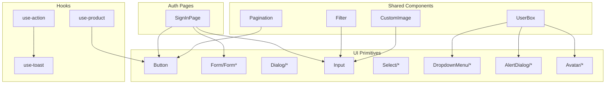
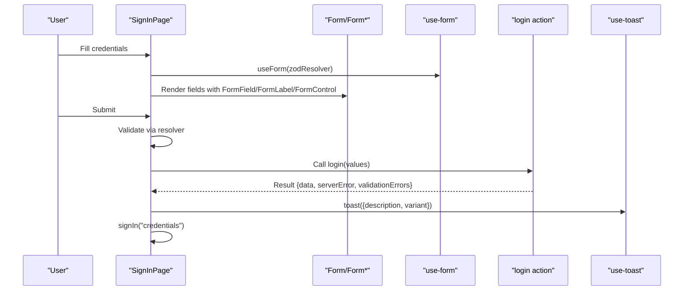
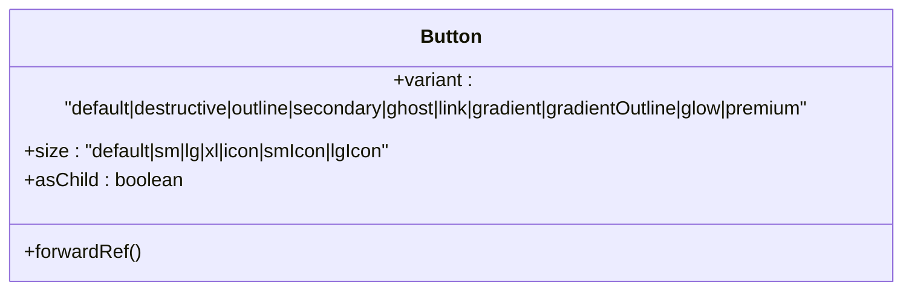
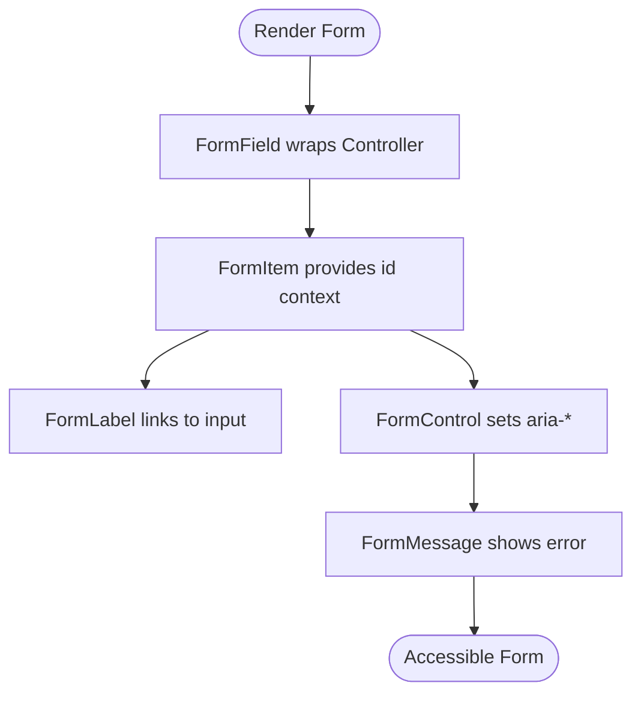
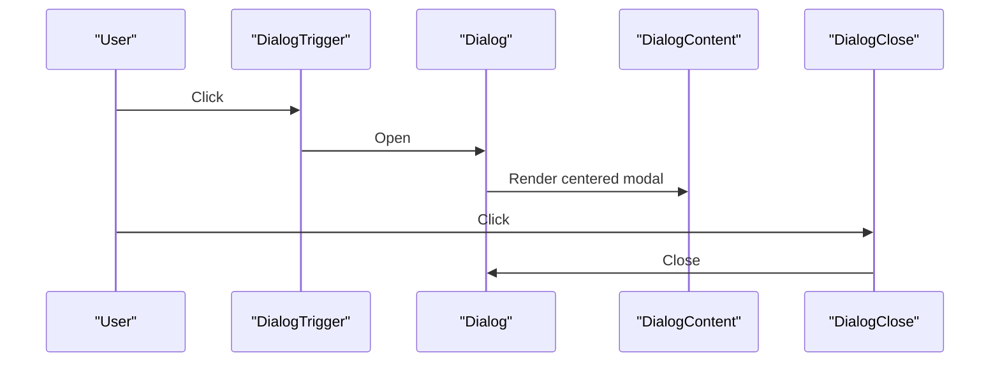
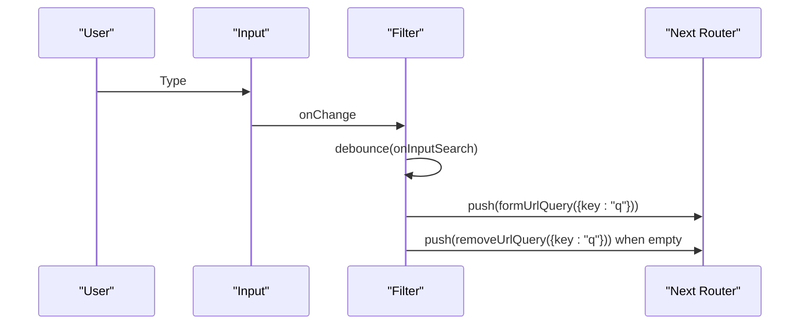
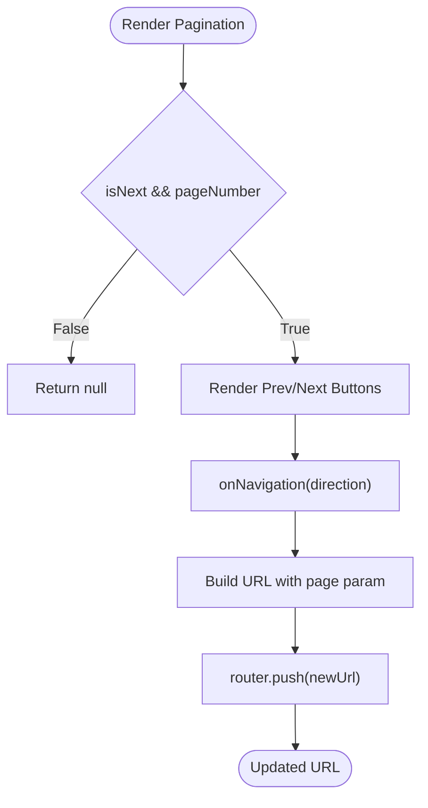
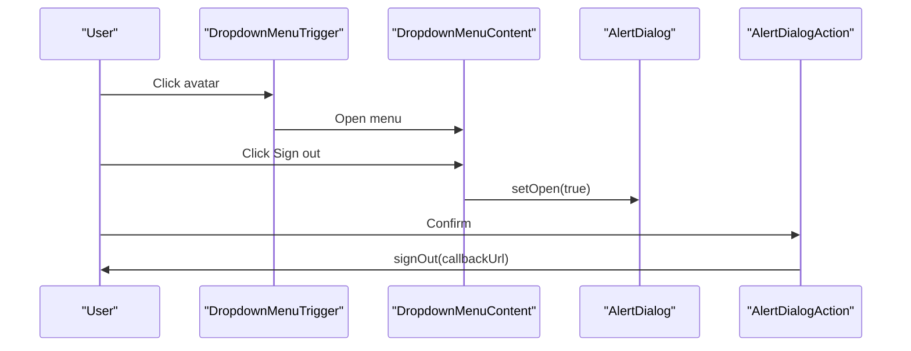
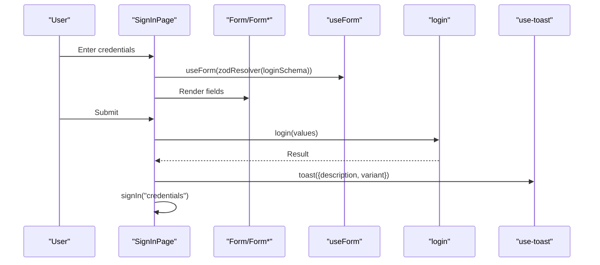
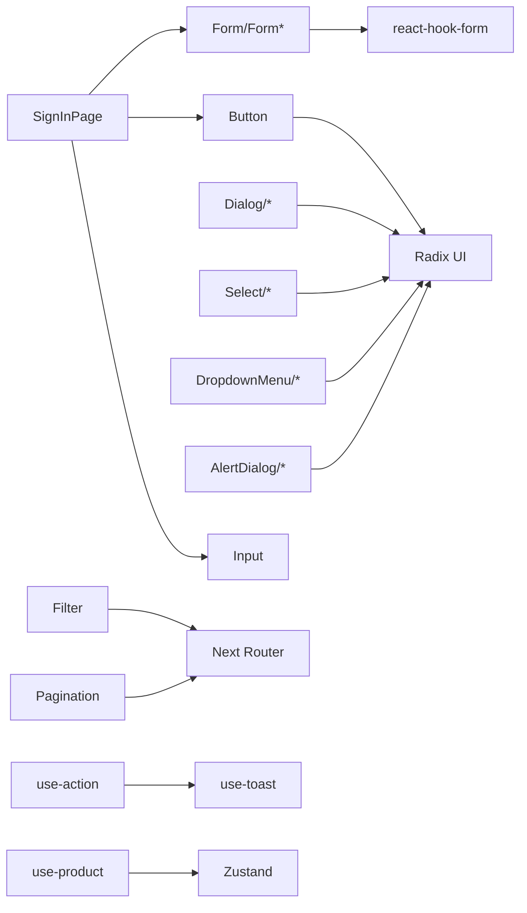

# UI Components

<cite>
**Referenced Files in This Document**
- [button.tsx](file://components/ui/button.tsx)
- [form.tsx](file://components/ui/form.tsx)
- [dialog.tsx](file://components/ui/dialog.tsx)
- [input.tsx](file://components/ui/input.tsx)
- [select.tsx](file://components/ui/select.tsx)
- [dropdown-menu.tsx](file://components/ui/dropdown-menu.tsx)
- [avatar.tsx](file://components/ui/avatar.tsx)
- [alert-dialog.tsx](file://components/ui/alert-dialog.tsx)
- [filter.tsx](file://components/shared/filter.tsx)
- [pagination.tsx](file://components/shared/pagination.tsx)
- [user-box.tsx](file://components/shared/user-box.tsx)
- [custom-image.tsx](file://components/shared/custom-image.tsx)
- [sign-in-page.tsx](file://components/auth/sign-in-page.tsx)
- [use-action.ts](file://hooks/use-action.ts)
- [use-product.ts](file://hooks/use-product.ts)
- [use-toast.ts](file://hooks/use-toast.ts)
</cite>

## Table of Contents
1. [Introduction](#introduction)
2. [Project Structure](#project-structure)
3. [Core Components](#core-components)
4. [Architecture Overview](#architecture-overview)
5. [Detailed Component Analysis](#detailed-component-analysis)
6. [Dependency Analysis](#dependency-analysis)
7. [Performance Considerations](#performance-considerations)
8. [Troubleshooting Guide](#troubleshooting-guide)
9. [Conclusion](#conclusion)
10. [Appendices](#appendices)

## Introduction
This document describes Optim Bozor’s UI component library built on Radix UI primitives and styled with Tailwind CSS. It covers accessible building blocks (buttons, forms, dialogs, inputs, selects, dropdowns, alerts, avatars), shared components for filtering, pagination, user boxes, and custom images, plus authentication-specific pages. It also documents custom hooks for actions, product state, and toast notifications, including props, usage patterns, accessibility, styling, composition, state management integration, and responsive design.

## Project Structure
The UI library is organized by domain:
- components/ui: Radix-based accessible primitives and composite components
- components/shared: reusable UI utilities (filters, pagination, user box, images)
- components/auth: authentication pages (sign-in, sign-up)
- hooks: custom hooks for actions, product store, and toasts

**Diagram sources**
- [button.tsx](file://components/ui/button.tsx)
- [form.tsx](file://components/ui/form.tsx)
- [dialog.tsx](file://components/ui/dialog.tsx)
- [input.tsx](file://components/ui/input.tsx)
- [select.tsx](file://components/ui/select.tsx)
- [dropdown-menu.tsx](file://components/ui/dropdown-menu.tsx)
- [alert-dialog.tsx](file://components/ui/alert-dialog.tsx)
- [avatar.tsx](file://components/ui/avatar.tsx)
- [filter.tsx](file://components/shared/filter.tsx)
- [pagination.tsx](file://components/shared/pagination.tsx)
- [user-box.tsx](file://components/shared/user-box.tsx)
- [custom-image.tsx](file://components/shared/custom-image.tsx)
- [sign-in-page.tsx](file://components/auth/sign-in-page.tsx)
- [use-action.ts](file://hooks/use-action.ts)
- [use-product.ts](file://hooks/use-product.ts)
- [use-toast.ts](file://hooks/use-toast.ts)

**Section sources**
- [button.tsx](file://components/ui/button.tsx)
- [form.tsx](file://components/ui/form.tsx)
- [dialog.tsx](file://components/ui/dialog.tsx)
- [input.tsx](file://components/ui/input.tsx)
- [select.tsx](file://components/ui/select.tsx)
- [dropdown-menu.tsx](file://components/ui/dropdown-menu.tsx)
- [alert-dialog.tsx](file://components/ui/alert-dialog.tsx)
- [avatar.tsx](file://components/ui/avatar.tsx)
- [filter.tsx](file://components/shared/filter.tsx)
- [pagination.tsx](file://components/shared/pagination.tsx)
- [user-box.tsx](file://components/shared/user-box.tsx)
- [custom-image.tsx](file://components/shared/custom-image.tsx)
- [sign-in-page.tsx](file://components/auth/sign-in-page.tsx)
- [use-action.ts](file://hooks/use-action.ts)
- [use-product.ts](file://hooks/use-product.ts)
- [use-toast.ts](file://hooks/use-toast.ts)

## Core Components
This section documents the accessible primitives and composite components that form the foundation of the design system.

- Button
  - Purpose: Unified action element with variants, sizes, and semantic roles.
  - Variants: default, destructive, outline, secondary, ghost, link, gradient, gradientOutline, glow, premium.
  - Sizes: default, sm, lg, xl, icon, smIcon, lgIcon.
  - Accessibility: Inherits native button semantics; supports focus-visible ring and pointer-events disabled state.
  - Composition: Supports asChild to wrap links or other elements.
  - Props: ButtonProps extends ButtonHTMLAttributes with variant, size, asChild.
  - Usage pattern: Wrap with motion for interactive feedback; pair with icons for affordance.

- Form/Form*
  - Purpose: Accessible form container and helpers using react-hook-form and Radix labels.
  - Components: Form (provider), FormField (controller wrapper), FormItem (context provider), FormLabel, FormControl, FormDescription, FormMessage, useFormField hook.
  - Accessibility: Links labels to inputs via generated ids; sets aria-invalid and aria-describedby on controls.
  - Props: FormField accepts ControllerProps; FormItem auto-generates id; useFormField exposes ids and state.
  - Usage pattern: Wrap fields in FormItem; pair FormLabel with FormControl; show FormMessage for errors.

- Dialog/*
  - Purpose: Modal overlay with animated content and close control.
  - Components: Root, Portal, Overlay, Trigger, Close, Content, Header, Footer, Title, Description.
  - Accessibility: Focus trapping via Radix; screen-reader friendly close button; controlled open/close state.
  - Props: Content supports animation classes; Footer arranges actions responsively.
  - Usage pattern: Trigger opens; Content wraps form or content; Footer aligns actions.

- Input
  - Purpose: Text input with consistent focus styles and placeholder handling.
  - Accessibility: Focus-visible ring; disabled state handled.
  - Props: Accepts standard input attributes; ref forwarded.
  - Usage pattern: Pair with icons for adornments; apply bg/rounded utilities for themed containers.

- Select/*
  - Purpose: Accessible single/multi-select with viewport scrolling and indicators.
  - Components: Root, Group, Value, Trigger, Content, Label, Item, Separator, ScrollUp/DownButton.
  - Accessibility: Keyboard navigation; focus management; indicator for selected item.
  - Props: Position prop affects popper offset; inset variants for nested items.
  - Usage pattern: Use Group/Label for optgroups; keep Items unstyled except selection.

- DropdownMenu/*
  - Purpose: Menu with submenus, checkboxes, radios, and shortcuts.
  - Components: Root, Trigger, Portal, Sub, SubContent, SubTrigger, RadioGroup, Content, Item*, Label, Separator, Shortcut.
  - Accessibility: Controlled open/close; keyboard navigation; focus styles.
  - Props: inset for nested items; sideOffset for positioning.
  - Usage pattern: Use SubTrigger/SubContent for nested menus; align icons with items.

- AlertDialog/*
  - Purpose: Confirmation dialogs with primary/secondary actions.
  - Components: Root, Portal, Overlay, Trigger, Close, Content, Header, Footer, Title, Description, Action, Cancel.
  - Accessibility: Focus management; Escape to close; accessible labels.
  - Props: Action and Cancel reuse Button variants; Content centers with animations.
  - Usage pattern: Trigger opens; onConfirm invokes action; onCancel aborts.

- Avatar/*
  - Purpose: User identity with fallback initials.
  - Components: Root, Image, Fallback.
  - Accessibility: Semantic image with alt; fallback visible when image fails.
  - Props: Forwarded refs; rounded-full by default.
  - Usage pattern: Wrap with gradient border for branded look; combine with UserBox.

**Section sources**
- [button.tsx](file://components/ui/button.tsx)
- [form.tsx](file://components/ui/form.tsx)
- [dialog.tsx](file://components/ui/dialog.tsx)
- [input.tsx](file://components/ui/input.tsx)
- [select.tsx](file://components/ui/select.tsx)
- [dropdown-menu.tsx](file://components/ui/dropdown-menu.tsx)
- [alert-dialog.tsx](file://components/ui/alert-dialog.tsx)
- [avatar.tsx](file://components/ui/avatar.tsx)

## Architecture Overview
The UI layer composes Radix primitives with Tailwind utilities and custom hooks. Authentication pages orchestrate forms, validation, and server actions, while shared components integrate with Next.js routing and URL queries.

**Diagram sources**
- [sign-in-page.tsx](file://components/auth/sign-in-page.tsx)
- [form.tsx](file://components/ui/form.tsx)
- [use-toast.ts](file://hooks/use-toast.ts)

**Section sources**
- [sign-in-page.tsx](file://components/auth/sign-in-page.tsx)
- [form.tsx](file://components/ui/form.tsx)
- [use-toast.ts](file://hooks/use-toast.ts)

## Detailed Component Analysis

### Button
- Variants and sizes are defined via class variance authority; focus-visible ring and disabled states are standardized.
- asChild enables composition with links or custom wrappers.
- Styling integrates with Tailwind utilities for shadows, gradients, and transitions.

**Diagram sources**
- [button.tsx](file://components/ui/button.tsx)

**Section sources**
- [button.tsx](file://components/ui/button.tsx)

### Form/Form* and Validation Integration
- Provides accessible form scaffolding with automatic labeling and error reporting.
- useFormField derives ids and error state; FormControl sets aria attributes.

**Diagram sources**
- [form.tsx](file://components/ui/form.tsx)

**Section sources**
- [form.tsx](file://components/ui/form.tsx)

### Dialog
- Composed with Portal and Overlay for proper stacking; Content animates in/out; Close button includes screen-reader text.

**Diagram sources**
- [dialog.tsx](file://components/ui/dialog.tsx)

**Section sources**
- [dialog.tsx](file://components/ui/dialog.tsx)

### Input
- Standardized focus ring and disabled state; commonly used inside adorned containers.

**Section sources**
- [input.tsx](file://components/ui/input.tsx)

### Select
- Supports grouped options, scrolling, and selection indicators; integrates with viewport sizing.

**Section sources**
- [select.tsx](file://components/ui/select.tsx)

### DropdownMenu
- Rich menu system with submenus, radio/checkbox items, and shortcuts; uses portal for outside-container rendering.

**Section sources**
- [dropdown-menu.tsx](file://components/ui/dropdown-menu.tsx)

### AlertDialog
- Reuses Button variants for actions; ensures focus management and accessible labels.

**Section sources**
- [alert-dialog.tsx](file://components/ui/alert-dialog.tsx)

### Avatar
- Provides image with fallback initials; useful within UserBox.

**Section sources**
- [avatar.tsx](file://components/ui/avatar.tsx)

### Shared Components

#### Filter
- Debounced URL query updates for search; integrates with Next.js router and URL search params.

**Diagram sources**
- [filter.tsx](file://components/shared/filter.tsx)

**Section sources**
- [filter.tsx](file://components/shared/filter.tsx)

#### Pagination
- Navigates page numbers via URL query updates; disables prev on first page and next when no more pages.

**Diagram sources**
- [pagination.tsx](file://components/shared/pagination.tsx)

**Section sources**
- [pagination.tsx](file://components/shared/pagination.tsx)

#### UserBox
- Combines DropdownMenu, AlertDialog, Avatar, and motion for a polished user menu with sign-out confirmation.

**Diagram sources**
- [user-box.tsx](file://components/shared/user-box.tsx)

**Section sources**
- [user-box.tsx](file://components/shared/user-box.tsx)

#### CustomImage
- Implements loading states with blur-scale transforms and priority loading for optimal CLS/performance.

**Section sources**
- [custom-image.tsx](file://components/shared/custom-image.tsx)

### Authentication-Specific Components

#### SignInPage
- Orchestrates Zod validation, react-hook-form, server action login, and NextAuth sign-in; displays toasts on success/error.

**Diagram sources**
- [sign-in-page.tsx](file://components/auth/sign-in-page.tsx)
- [form.tsx](file://components/ui/form.tsx)
- [use-toast.ts](file://hooks/use-toast.ts)

**Section sources**
- [sign-in-page.tsx](file://components/auth/sign-in-page.tsx)
- [form.tsx](file://components/ui/form.tsx)
- [use-toast.ts](file://hooks/use-toast.ts)

### Custom Hooks

#### use-action
- Centralizes loading state and error toast behavior for server actions.

**Section sources**
- [use-action.ts](file://hooks/use-action.ts)

#### use-product
- Zustand-backed store for product state and visibility toggle.

**Section sources**
- [use-product.ts](file://hooks/use-product.ts)

#### use-toast
- Toast notification service used across components.

**Section sources**
- [use-toast.ts](file://hooks/use-toast.ts)

## Dependency Analysis
- UI primitives depend on Radix UI and Lucide icons; they expose consistent variants and sizes.
- Shared components integrate with Next.js routing and URL manipulation utilities.
- Authentication pages depend on react-hook-form, Zod resolver, and NextAuth.
- Custom hooks encapsulate cross-cutting concerns (loading, state, notifications).

**Diagram sources**
- [button.tsx](file://components/ui/button.tsx)
- [form.tsx](file://components/ui/form.tsx)
- [dialog.tsx](file://components/ui/dialog.tsx)
- [select.tsx](file://components/ui/select.tsx)
- [dropdown-menu.tsx](file://components/ui/dropdown-menu.tsx)
- [alert-dialog.tsx](file://components/ui/alert-dialog.tsx)
- [filter.tsx](file://components/shared/filter.tsx)
- [pagination.tsx](file://components/shared/pagination.tsx)
- [sign-in-page.tsx](file://components/auth/sign-in-page.tsx)
- [use-action.ts](file://hooks/use-action.ts)
- [use-product.ts](file://hooks/use-product.ts)
- [use-toast.ts](file://hooks/use-toast.ts)

**Section sources**
- [button.tsx](file://components/ui/button.tsx)
- [form.tsx](file://components/ui/form.tsx)
- [dialog.tsx](file://components/ui/dialog.tsx)
- [select.tsx](file://components/ui/select.tsx)
- [dropdown-menu.tsx](file://components/ui/dropdown-menu.tsx)
- [alert-dialog.tsx](file://components/ui/alert-dialog.tsx)
- [filter.tsx](file://components/shared/filter.tsx)
- [pagination.tsx](file://components/shared/pagination.tsx)
- [sign-in-page.tsx](file://components/auth/sign-in-page.tsx)
- [use-action.ts](file://hooks/use-action.ts)
- [use-product.ts](file://hooks/use-product.ts)
- [use-toast.ts](file://hooks/use-toast.ts)

## Performance Considerations
- Prefer asChild for Button to avoid unnecessary DOM nodes; leverage motion for lightweight animations.
- Debounce search input to reduce URL updates and network calls.
- Use priority and sizes on images to improve CLS and loading performance.
- Keep Select/Dialog/DropdownMenu portals scoped to minimize re-renders.
- Use zustand stores for small UI state to avoid prop drilling.

## Troubleshooting Guide
- Forms
  - Ensure FormField wraps Controller and FormItem provides context; otherwise useFormField throws an error.
  - Verify aria-invalid and aria-describedby are set on FormControl for accessible error reporting.
- Dialogs
  - Confirm Portal is present so Content renders above overlays; ensure Close button exists for keyboard users.
- Inputs and Selects
  - Disabled states should prevent interactions; verify focus rings appear on focus-visible.
- Authentication
  - If toasts do not appear, confirm use-toast is initialized and not overridden by global styles.
  - If sign-in does not redirect, check callbackUrl and NextAuth configuration.

**Section sources**
- [form.tsx](file://components/ui/form.tsx)
- [dialog.tsx](file://components/ui/dialog.tsx)
- [input.tsx](file://components/ui/input.tsx)
- [select.tsx](file://components/ui/select.tsx)
- [sign-in-page.tsx](file://components/auth/sign-in-page.tsx)
- [use-toast.ts](file://hooks/use-toast.ts)

## Conclusion
Optim Bozor’s UI library emphasizes accessibility, composability, and consistency through Radix primitives and Tailwind utilities. Shared components streamline common tasks like filtering, pagination, and user management, while authentication pages demonstrate robust form handling and state integration. Custom hooks centralize cross-cutting concerns, enabling scalable and maintainable UI development.

## Appendices

### Props Reference Summary
- Button
  - variant: "default|destructive|outline|secondary|ghost|link|gradient|gradientOutline|glow|premium"
  - size: "default|sm|lg|xl|icon|smIcon|lgIcon"
  - asChild: boolean
- Form/Form*
  - FormField: ControllerProps
  - FormItem: HTML div attributes
  - FormLabel: Radix label attributes
  - FormControl: Slot attributes
  - FormMessage: paragraph attributes
- Dialog/*
  - Content: animation and positioning classes
  - Footer: responsive alignment
- Input
  - Standard input attributes
- Select/*
  - Trigger/content positioning and scrolling
- DropdownMenu/*
  - Submenu nesting and item types
- AlertDialog/*
  - Action/Cancellation variants
- Filter
  - onChange debounced handler
- Pagination
  - pageNumber: number, isNext: boolean
- UserBox
  - user: DefaultSession["user"]
- CustomImage
  - src: string, alt: string, className?: string
- use-action
  - isLoading: boolean, setIsLoading(fn), onError(message)
- use-product
  - product: IProduct1 | null, setProduct(p), open: boolean, setOpen(o)

### Styling and Accessibility Guidelines
- Use Tailwind utilities for spacing, colors, and shadows; rely on component variants for consistency.
- Maintain focus-visible rings and disabled states for keyboard navigation.
- Pair labels with inputs; set aria-invalid and aria-describedby for error reporting.
- Use motion sparingly for micro-interactions; avoid heavy animations on low-power devices.
- Respect dark mode tokens and ensure sufficient color contrast.