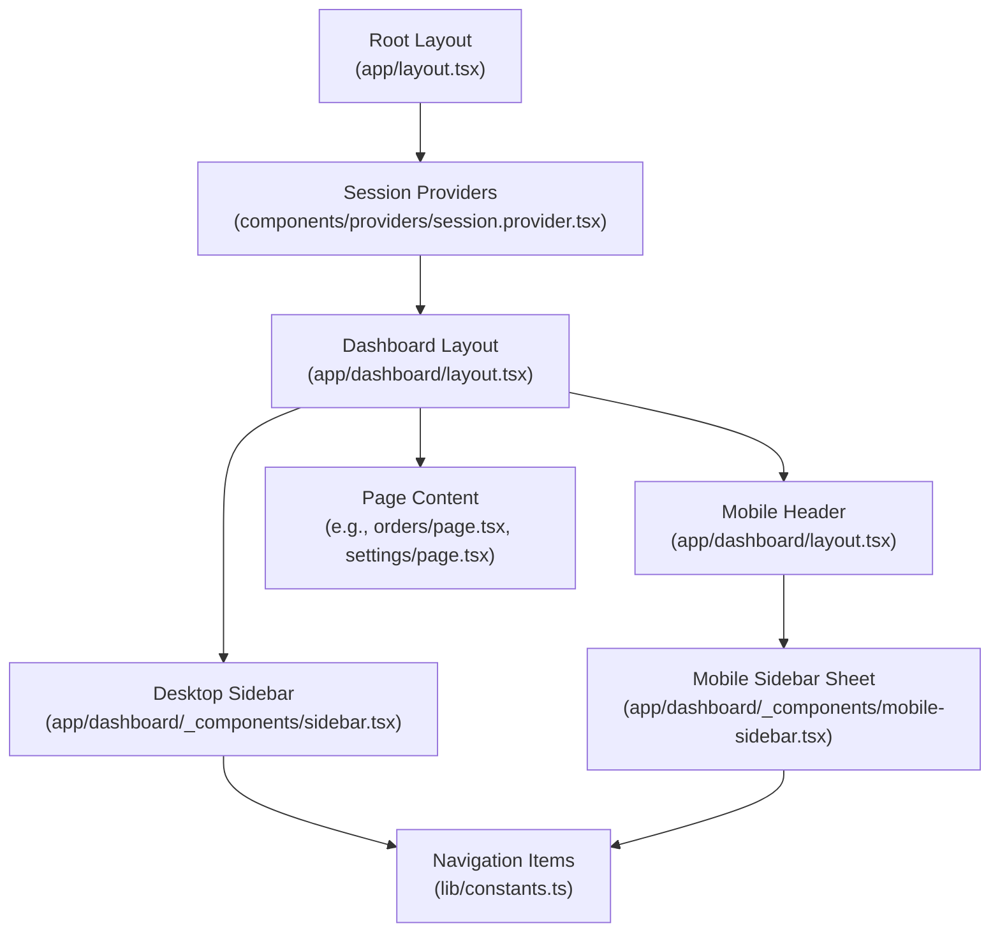
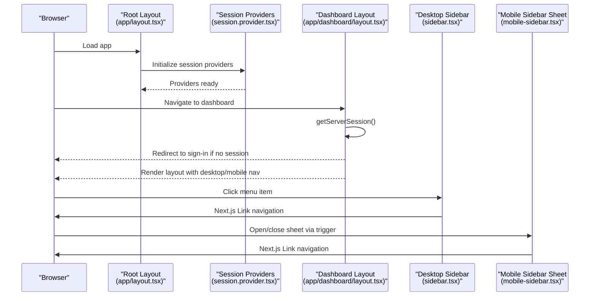
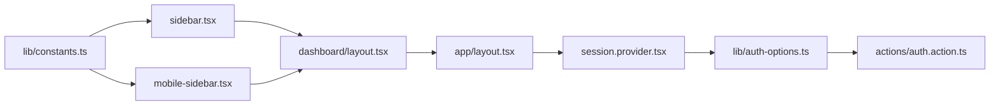

# Dashboard Layout and Navigation

<cite>
**Referenced Files in This Document**
- [app/dashboard/layout.tsx](file://app/dashboard/layout.tsx)
- [app/dashboard/_components/sidebar.tsx](file://app/dashboard/_components/sidebar.tsx)
- [app/dashboard/_components/mobile-sidebar.tsx](file://app/dashboard/_components/mobile-sidebar.tsx)
- [lib/constants.ts](file://lib/constants.ts)
- [app/layout.tsx](file://app/layout.tsx)
- [components/providers/session.provider.tsx](file://components/providers/session.provider.tsx)
- [lib/auth-options.ts](file://lib/auth-options.ts)
- [actions/auth.action.ts](file://actions/auth.action.ts)
- [app/dashboard/orders/page.tsx](file://app/dashboard/orders/page.tsx)
- [app/dashboard/settings/page.tsx](file://app/dashboard/settings/page.tsx)
</cite>

## Table of Contents
1. [Introduction](#introduction)
2. [Project Structure](#project-structure)
3. [Core Components](#core-components)
4. [Architecture Overview](#architecture-overview)
5. [Detailed Component Analysis](#detailed-component-analysis)
6. [Dependency Analysis](#dependency-analysis)
7. [Performance Considerations](#performance-considerations)
8. [Troubleshooting Guide](#troubleshooting-guide)
9. [Conclusion](#conclusion)

## Introduction
This document explains the dashboard layout and navigation system, focusing on the main layout component, desktop and mobile sidebar implementations, route-based navigation, active state management, and integration with Next.js App Router. It also covers responsive breakpoints, navigation state persistence, user session awareness, and accessibility considerations for keyboard navigation.

## Project Structure
The dashboard is organized under the Next.js App Router with a dedicated dashboard route group. The layout composes a desktop sidebar, a mobile sheet-based sidebar, and the page content area. Navigation items are centrally defined and reused across components.

**Diagram sources**
- [app/layout.tsx:49-70](file://app/layout.tsx#L49-L70)
- [components/providers/session.provider.tsx:31-38](file://components/providers/session.provider.tsx#L31-L38)
- [app/dashboard/layout.tsx:11-42](file://app/dashboard/layout.tsx#L11-L42)
- [app/dashboard/_components/sidebar.tsx:12-100](file://app/dashboard/_components/sidebar.tsx#L12-L100)
- [app/dashboard/_components/mobile-sidebar.tsx:13-84](file://app/dashboard/_components/mobile-sidebar.tsx#L13-L84)
- [lib/constants.ts:13-17](file://lib/constants.ts#L13-L17)

**Section sources**
- [app/dashboard/layout.tsx:11-42](file://app/dashboard/layout.tsx#L11-L42)
- [lib/constants.ts:13-17](file://lib/constants.ts#L13-L17)

## Core Components
- Dashboard Layout: Orchestrates desktop and mobile navigation, enforces session checks, and renders page content.
- Desktop Sidebar: Renders persistent navigation items, active state indicators, and back-link to the store.
- Mobile Sidebar Sheet: Provides a drawer-style navigation for small screens with a trigger in the mobile header.
- Navigation Data: Centralized list of menu items with name, route, and icon.

Key responsibilities:
- Route-based navigation: Links use Next.js Link with dynamic route matching for active states.
- Active state management: Uses current pathname to highlight the active item.
- Responsive behavior: Desktop sidebar hidden on small screens; mobile sheet appears below medium breakpoints.
- Session-awareness: Server-side redirect if no session exists; client-side session updates after profile changes.

**Section sources**
- [app/dashboard/layout.tsx:11-42](file://app/dashboard/layout.tsx#L11-L42)
- [app/dashboard/_components/sidebar.tsx:12-100](file://app/dashboard/_components/sidebar.tsx#L12-L100)
- [app/dashboard/_components/mobile-sidebar.tsx:13-84](file://app/dashboard/_components/mobile-sidebar.tsx#L13-L84)
- [lib/constants.ts:13-17](file://lib/constants.ts#L13-L17)

## Architecture Overview
The dashboard layout integrates with Next.js App Router and NextAuth.js. The root layout wraps the app with session providers. The dashboard layout enforces authentication and renders the desktop/mobile navigation alongside page content. Navigation items are defined centrally and rendered in both desktop and mobile components.

**Diagram sources**
- [app/layout.tsx:49-70](file://app/layout.tsx#L49-L70)
- [components/providers/session.provider.tsx:31-38](file://components/providers/session.provider.tsx#L31-L38)
- [app/dashboard/layout.tsx:11-42](file://app/dashboard/layout.tsx#L11-L42)
- [app/dashboard/_components/sidebar.tsx:12-100](file://app/dashboard/_components/sidebar.tsx#L12-L100)
- [app/dashboard/_components/mobile-sidebar.tsx:13-84](file://app/dashboard/_components/mobile-sidebar.tsx#L13-L84)

## Detailed Component Analysis

### Dashboard Layout
Responsibilities:
- Enforce authentication via server session.
- Render desktop sidebar on larger screens and a mobile header with a sidebar trigger on small screens.
- Provide a main content area that fills remaining space and scrolls independently.

Responsive behavior:
- Desktop sidebar is hidden on small screens using a breakpoint class.
- Mobile header displays a back link and a trigger to open the mobile sheet.

Navigation state:
- Delegated to child components (desktop and mobile sidebars) using client-side path tracking.

**Section sources**
- [app/dashboard/layout.tsx:11-42](file://app/dashboard/layout.tsx#L11-L42)

### Desktop Sidebar
Responsibilities:
- Render logo and branding.
- Display dashboard header with icon.
- Render navigation items from centralized constants.
- Highlight the active item based on current pathname.
- Provide a back-to-store link.

Active state management:
- Compares current pathname with each item’s route to compute active state.
- Applies distinct styles for active and inactive items, including a trailing indicator.

Animations and UX:
- Uses a staggered animation for menu items.
- Adds subtle hover/tap animations for interactive feedback.

Accessibility:
- Uses semantic links and maintains focus order.
- Ensures sufficient color contrast for active/inactive states.

**Section sources**
- [app/dashboard/_components/sidebar.tsx:12-100](file://app/dashboard/_components/sidebar.tsx#L12-L100)
- [lib/constants.ts:13-17](file://lib/constants.ts#L13-L17)

### Mobile Sidebar Sheet
Responsibilities:
- Provide a slide-out drawer on small screens.
- Mirror the desktop navigation structure.
- Close the sheet after selecting an item.
- Display branding and a footer area.

Active state management:
- Uses a variant toggle based on pathname to visually indicate the active item.

Interaction model:
- Uses a trigger button to open the sheet.
- Clicking a menu item closes the sheet and navigates.

Accessibility:
- Uses a screen-reader-friendly label on the trigger.
- Maintains focus within the sheet until closed.

**Section sources**
- [app/dashboard/_components/mobile-sidebar.tsx:13-84](file://app/dashboard/_components/mobile-sidebar.tsx#L13-L84)
- [lib/constants.ts:13-17](file://lib/constants.ts#L13-L17)

### Navigation Data (Constants)
Responsibilities:
- Define the navigation hierarchy with human-readable names, routes, and icons.
- Serve as the single source of truth for menu items across desktop and mobile components.

Integration:
- Imported by both desktop and mobile sidebar components.
- Enables consistent updates to navigation without duplicating logic.

**Section sources**
- [lib/constants.ts:13-17](file://lib/constants.ts#L13-L17)

### Session Awareness and Authentication Flow
Responsibilities:
- Root layout initializes session providers.
- Dashboard layout performs server-side session check and redirects unauthenticated users.
- Session provider handles OAuth auto-login and session updates.
- Authentication options define JWT/session strategies and session callbacks.

Integration:
- NextAuth.js manages session state and user data hydration.
- Client-side session updates occur after profile changes to keep UI synchronized.

**Section sources**
- [app/layout.tsx:49-70](file://app/layout.tsx#L49-L70)
- [components/providers/session.provider.tsx:31-38](file://components/providers/session.provider.tsx#L31-L38)
- [lib/auth-options.ts:8-127](file://lib/auth-options.ts#L8-L127)
- [actions/auth.action.ts:13-50](file://actions/auth.action.ts#L13-L50)

### Route-Based Navigation Patterns
Patterns:
- Next.js Link components wrap menu items for client-side navigation.
- Pathname comparison determines active state for both desktop and mobile menus.
- Back-to-store link uses a simple Link to the root route.

Consistency:
- Navigation items are defined centrally, ensuring identical routes and icons across components.

**Section sources**
- [app/dashboard/_components/sidebar.tsx:47-80](file://app/dashboard/_components/sidebar.tsx#L47-L80)
- [app/dashboard/_components/mobile-sidebar.tsx:52-71](file://app/dashboard/_components/mobile-sidebar.tsx#L52-L71)
- [lib/constants.ts:13-17](file://lib/constants.ts#L13-L17)

### Example Pages and Navigation Context
- Orders page demonstrates route-specific content within the dashboard layout.
- Settings page illustrates user-driven navigation and destructive actions.

Context:
- Both pages render inside the dashboard layout, inheriting the shared navigation and responsive behavior.

**Section sources**
- [app/dashboard/orders/page.tsx:58-203](file://app/dashboard/orders/page.tsx#L58-L203)
- [app/dashboard/settings/page.tsx:29-151](file://app/dashboard/settings/page.tsx#L29-L151)

## Dependency Analysis
The dashboard navigation system relies on:
- Next.js App Router for routing and navigation.
- NextAuth.js for session management and user hydration.
- UI primitives from shared components for buttons, sheets, and separators.
- Centralized constants for navigation definitions.

**Diagram sources**
- [lib/constants.ts:13-17](file://lib/constants.ts#L13-L17)
- [app/dashboard/_components/sidebar.tsx:12-100](file://app/dashboard/_components/sidebar.tsx#L12-L100)
- [app/dashboard/_components/mobile-sidebar.tsx:13-84](file://app/dashboard/_components/mobile-sidebar.tsx#L13-L84)
- [app/dashboard/layout.tsx:11-42](file://app/dashboard/layout.tsx#L11-L42)
- [app/layout.tsx:49-70](file://app/layout.tsx#L49-L70)
- [components/providers/session.provider.tsx:31-38](file://components/providers/session.provider.tsx#L31-L38)
- [lib/auth-options.ts:8-127](file://lib/auth-options.ts#L8-L127)
- [actions/auth.action.ts:13-50](file://actions/auth.action.ts#L13-L50)

**Section sources**
- [lib/constants.ts:13-17](file://lib/constants.ts#L13-L17)
- [app/dashboard/_components/sidebar.tsx:12-100](file://app/dashboard/_components/sidebar.tsx#L12-L100)
- [app/dashboard/_components/mobile-sidebar.tsx:13-84](file://app/dashboard/_components/mobile-sidebar.tsx#L13-L84)
- [app/dashboard/layout.tsx:11-42](file://app/dashboard/layout.tsx#L11-L42)
- [app/layout.tsx:49-70](file://app/layout.tsx#L49-L70)
- [components/providers/session.provider.tsx:31-38](file://components/providers/session.provider.tsx#L31-L38)
- [lib/auth-options.ts:8-127](file://lib/auth-options.ts#L8-L127)
- [actions/auth.action.ts:13-50](file://actions/auth.action.ts#L13-L50)

## Performance Considerations
- Keep navigation lists concise to minimize re-renders.
- Use client-side navigation (Next.js Link) to avoid full-page reloads.
- Avoid heavy computations in the active state logic; rely on simple pathname comparisons.
- Consider virtualizing long lists if navigation grows significantly.

## Troubleshooting Guide
Common issues and resolutions:
- Unauthenticated access to dashboard: The layout performs a server-side redirect to the sign-in page if no session is present. Ensure session providers are initialized at the root level.
- Active state not updating: Verify that the pathname is compared against the exact route strings defined in constants.
- Mobile sheet not closing: Confirm that menu items close the sheet by calling the appropriate handler and that the sheet’s open state is controlled by the trigger.
- Session not updating after profile change: Ensure client-side session updates are invoked after successful mutations.

**Section sources**
- [app/dashboard/layout.tsx:11-14](file://app/dashboard/layout.tsx#L11-L14)
- [app/dashboard/_components/sidebar.tsx:47-80](file://app/dashboard/_components/sidebar.tsx#L47-L80)
- [app/dashboard/_components/mobile-sidebar.tsx:52-71](file://app/dashboard/_components/mobile-sidebar.tsx#L52-L71)
- [components/providers/session.provider.tsx:31-38](file://components/providers/session.provider.tsx#L31-L38)

## Conclusion
The dashboard layout and navigation system leverages Next.js App Router and NextAuth.js to deliver a responsive, session-aware interface. The desktop and mobile sidebars share a centralized navigation definition, ensuring consistency and maintainability. Active state management is handled via pathname comparisons, and the design follows mobile-first principles with accessible interactions.