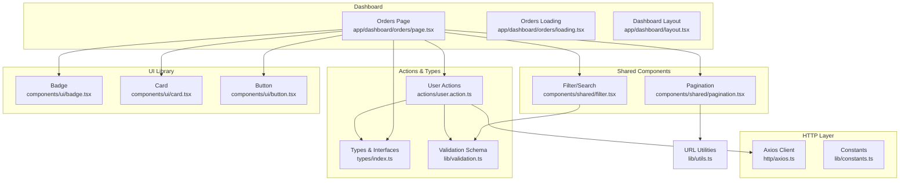
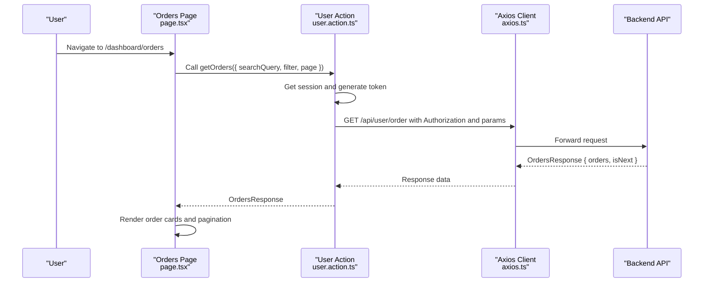
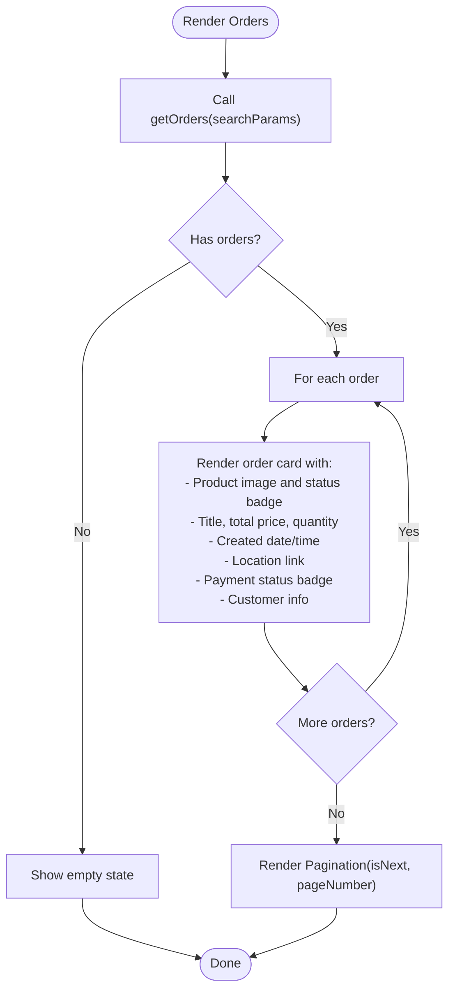
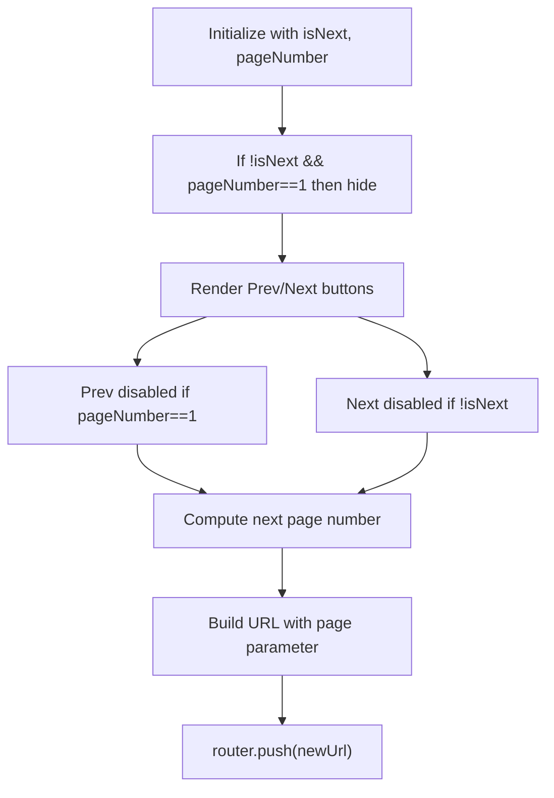
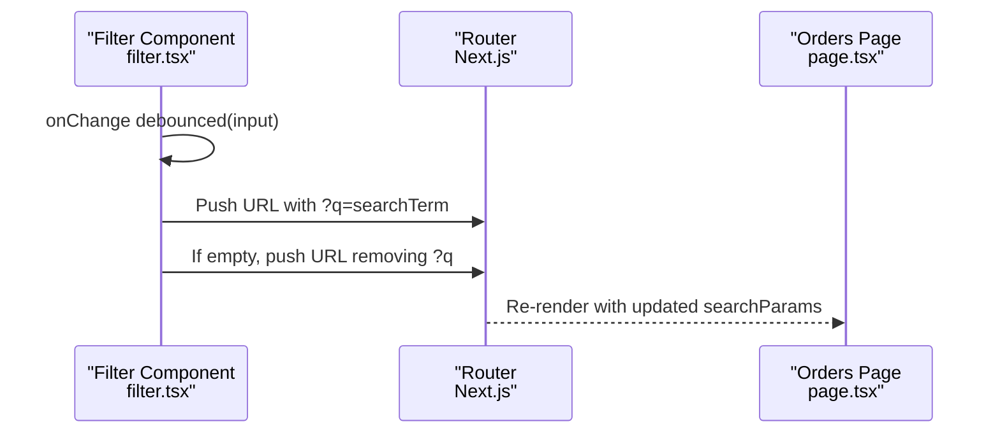
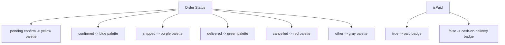
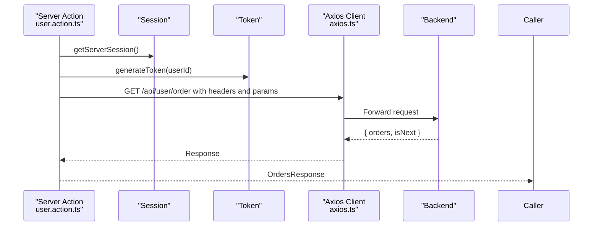
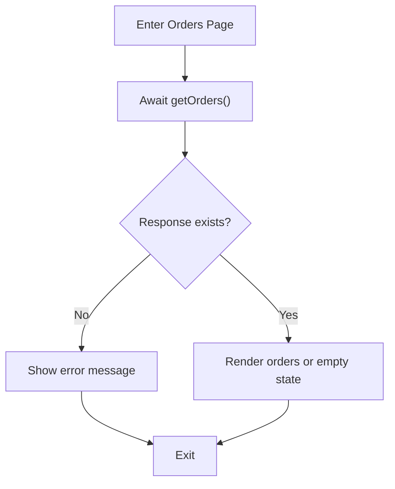
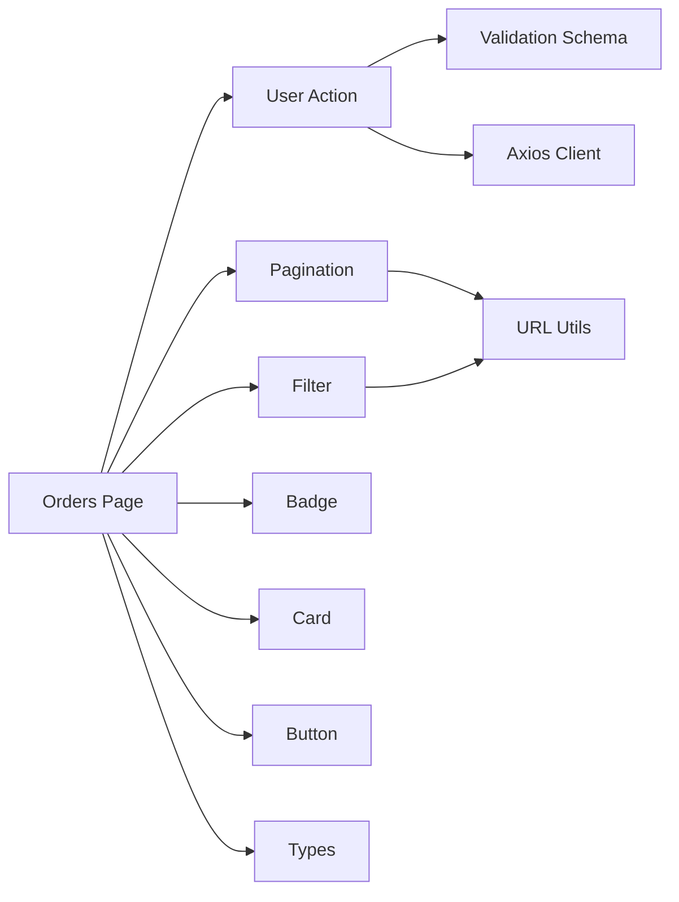

# Order History and Tracking

<cite>
**Referenced Files in This Document**
- [page.tsx](file://app/dashboard/orders/page.tsx)
- [loading.tsx](file://app/dashboard/orders/loading.tsx)
- [pagination.tsx](file://components/shared/pagination.tsx)
- [user.action.ts](file://actions/user.action.ts)
- [index.ts](file://types/index.ts)
- [utils.ts](file://lib/utils.ts)
- [filter.tsx](file://components/shared/filter.tsx)
- [layout.tsx](file://app/dashboard/layout.tsx)
- [axios.ts](file://http/axios.ts)
- [validation.ts](file://lib/validation.ts)
- [constants.ts](file://lib/constants.ts)
- [badge.tsx](file://components/ui/badge.tsx)
- [card.tsx](file://components/ui/card.tsx)
- [button.tsx](file://components/ui/button.tsx)
</cite>

## Table of Contents
1. [Introduction](#introduction)
2. [Project Structure](#project-structure)
3. [Core Components](#core-components)
4. [Architecture Overview](#architecture-overview)
5. [Detailed Component Analysis](#detailed-component-analysis)
6. [Dependency Analysis](#dependency-analysis)
7. [Performance Considerations](#performance-considerations)
8. [Troubleshooting Guide](#troubleshooting-guide)
9. [Conclusion](#conclusion)

## Introduction
This document describes the order history and tracking system implemented in the dashboard. It covers the order listing interface, order status display, pagination, data fetching patterns, status categorization, and integration with backend APIs. It also documents search and filtering capabilities, loading states, error handling, and the UI components used to present order items and shipping information.

## Project Structure
The order history feature resides under the dashboard routes and uses shared components for pagination and filtering. Data fetching is performed server-side via action functions that communicate with the backend API through an Axios client configured with environment variables.

**Diagram sources**
- [page.tsx:1-206](file://app/dashboard/orders/page.tsx#L1-L206)
- [loading.tsx:1-12](file://app/dashboard/orders/loading.tsx#L1-L12)
- [pagination.tsx:1-57](file://components/shared/pagination.tsx#L1-L57)
- [filter.tsx:1-49](file://components/shared/filter.tsx#L1-L49)
- [user.action.ts:61-72](file://actions/user.action.ts#L61-L72)
- [index.ts:74-103](file://types/index.ts#L74-L103)
- [validation.ts:75-81](file://lib/validation.ts#L75-L81)
- [axios.ts:1-10](file://http/axios.ts#L1-L10)
- [utils.ts:19-26](file://lib/utils.ts#L19-L26)
- [badge.tsx:1-30](file://components/ui/badge.tsx#L1-L30)
- [card.tsx:1-77](file://components/ui/card.tsx#L1-L77)
- [button.tsx:1-73](file://components/ui/button.tsx#L1-L73)

**Section sources**
- [page.tsx:1-206](file://app/dashboard/orders/page.tsx#L1-L206)
- [layout.tsx:11-42](file://app/dashboard/layout.tsx#L11-L42)

## Core Components
- Orders listing page: Renders order cards with product image, title, total price, quantity, creation date/time, shipping location, payment status, and customer info. Implements status badges with color-coded styles and links to Google Maps for the delivery location.
- Pagination component: Handles navigation between pages by updating the URL query parameter for page number and controlling previous/next buttons based on isNext flag returned by the backend.
- Filtering/search component: Provides a debounced search input that updates the query parameter q and clears it when empty.
- Action layer: Fetches orders via a server action that authenticates with a session-generated token and calls the backend endpoint with search, filter, and pagination parameters.
- Types and validation: Defines order response shape and validates search parameters including page and pageSize defaults.

**Section sources**
- [page.tsx:58-203](file://app/dashboard/orders/page.tsx#L58-L203)
- [pagination.tsx:13-53](file://components/shared/pagination.tsx#L13-L53)
- [filter.tsx:10-48](file://components/shared/filter.tsx#L10-L48)
- [user.action.ts:61-72](file://actions/user.action.ts#L61-L72)
- [index.ts:74-103](file://types/index.ts#L74-L103)
- [validation.ts:75-81](file://lib/validation.ts#L75-L81)

## Architecture Overview
The order history feature follows a server action pattern for data fetching, ensuring secure and authenticated requests. The client-side UI composes reusable components for pagination and filtering while delegating network concerns to server actions.

**Diagram sources**
- [page.tsx:60-64](file://app/dashboard/orders/page.tsx#L60-L64)
- [user.action.ts:61-72](file://actions/user.action.ts#L61-L72)
- [axios.ts:5-9](file://http/axios.ts#L5-L9)

## Detailed Component Analysis

### Orders Listing Interface
- Data fetching: The page invokes a server action passing search, filter, and page parameters derived from URL search parameters. The action returns an OrdersResponse containing orders and isNext.
- Rendering: For each order, the page displays:
  - Product image and status badge with color-coded styling based on order status.
  - Product title, total price (formatted currency), and quantity.
  - Creation date and time.
  - Delivery location with a link to open the coordinates in Google Maps.
  - Payment status badge indicating cash-on-delivery vs paid.
  - Customer name and email.
- Empty state: When no orders are found, a friendly message with an icon is shown.
- Pagination: The page renders a pagination component that controls navigation based on isNext and current page number.

**Diagram sources**
- [page.tsx:60-200](file://app/dashboard/orders/page.tsx#L60-L200)
- [pagination.tsx:13-53](file://components/shared/pagination.tsx#L13-L53)

**Section sources**
- [page.tsx:58-203](file://app/dashboard/orders/page.tsx#L58-L203)
- [index.ts:88-103](file://types/index.ts#L88-L103)

### Pagination Implementation
- Navigation: The component reads the current page number from URL search parameters and computes next/previous page numbers. It constructs a new URL with the updated page parameter and navigates without scrolling.
- Controls: Previous button is disabled on the first page; Next button is disabled when isNext is false. The component is hidden when there is no next page and the current page is the first.

**Diagram sources**
- [pagination.tsx:13-53](file://components/shared/pagination.tsx#L13-L53)
- [utils.ts:19-26](file://lib/utils.ts#L19-L26)

**Section sources**
- [pagination.tsx:13-53](file://components/shared/pagination.tsx#L13-L53)
- [utils.ts:19-26](file://lib/utils.ts#L19-L26)

### Search and Filtering
- Search: The filter component debounces input changes and updates the query parameter q. When the input becomes empty, it removes the q parameter from the URL.
- Filtering: The server action accepts a filter parameter that is forwarded to the backend. The page itself does not implement explicit UI filters beyond search; the filter parameter can be used by the backend to restrict results.

**Diagram sources**
- [filter.tsx:14-32](file://components/shared/filter.tsx#L14-L32)
- [page.tsx:60-64](file://app/dashboard/orders/page.tsx#L60-L64)

**Section sources**
- [filter.tsx:10-48](file://components/shared/filter.tsx#L10-L48)
- [validation.ts:75-81](file://lib/validation.ts#L75-L81)

### Order Status Categorization and Display
- Status colors: The page applies color classes to badges based on order status values. Supported statuses include pending confirm, confirmed, shipped, delivered, and cancelled.
- Payment status: A dedicated helper maps isPaid to either a paid badge or a cash-on-delivery badge.

**Diagram sources**
- [page.tsx:28-56](file://app/dashboard/orders/page.tsx#L28-L56)

**Section sources**
- [page.tsx:28-56](file://app/dashboard/orders/page.tsx#L28-L56)

### Data Fetching Patterns and Backend Integration
- Authentication: The server action retrieves the session and generates a token to include in the Authorization header.
- Endpoint: Calls GET /api/user/order with query parameters for search, filter, and pagination.
- Response: Expects OrdersResponse with orders array and isNext boolean.

**Diagram sources**
- [user.action.ts:61-72](file://actions/user.action.ts#L61-L72)
- [axios.ts:5-9](file://http/axios.ts#L5-L9)

**Section sources**
- [user.action.ts:61-72](file://actions/user.action.ts#L61-L72)
- [axios.ts:3-9](file://http/axios.ts#L3-L9)

### Loading States and Error Handling
- Loading: The page includes a dedicated loading component that renders minimal content while data loads.
- Error handling: On empty or failed responses, the page displays a centered message indicating a problem occurred and prompting the user to retry later.

**Diagram sources**
- [page.tsx:66-79](file://app/dashboard/orders/page.tsx#L66-L79)
- [loading.tsx:1-12](file://app/dashboard/orders/loading.tsx#L1-L12)

**Section sources**
- [page.tsx:66-79](file://app/dashboard/orders/page.tsx#L66-L79)
- [loading.tsx:1-12](file://app/dashboard/orders/loading.tsx#L1-L12)

### Order Detail Viewing and Timeline Visualization
- Detail view: The current implementation lists orders but does not include a dedicated order detail modal or page. Users can see product images, quantities, prices, dates, locations, and payment status within the order cards.
- Timeline: There is no explicit order timeline visualization in the current code. The status is displayed as a badge, and the creation date is shown.

Note: If a detail modal or timeline were to be introduced, typical patterns would include:
- A modal triggered from the order card that fetches detailed order information and renders status transitions and events.
- A timeline component that visualizes status changes over time, possibly integrating with transaction or audit logs.

[No sources needed since this section describes missing features conceptually]

### Order Cancellation and Refund Processes
- Cancellation/refund: The current order listing does not expose cancellation or refund actions. The presence of a TransactionState constant suggests potential transactional states elsewhere in the system, but cancellation/refund UI or actions are not present in the orders page.

[No sources needed since this section describes missing features conceptually]

### Sorting and Export Features
- Sorting: The current implementation does not include explicit sorting controls. The server action schema includes optional category and filter parameters, but the page does not render sorting UI.
- Export: There is no order export feature in the current code.

[No sources needed since this section describes missing features conceptually]

### Shipping Information Presentation
- The order card displays latitude and longitude and provides a link to open the location in Google Maps. Payment status is indicated via a badge.

**Section sources**
- [page.tsx:154-171](file://app/dashboard/orders/page.tsx#L154-L171)

## Dependency Analysis
The order history feature depends on:
- Server action for authenticated data retrieval.
- Shared pagination and filter components for navigation and search.
- UI primitives (Badge, Card, Button) for consistent rendering.
- Type definitions for order data structures.
- URL utilities for building query strings.

**Diagram sources**
- [page.tsx:1-11](file://app/dashboard/orders/page.tsx#L1-L11)
- [pagination.tsx:1-6](file://components/shared/pagination.tsx#L1-L6)
- [filter.tsx:1-7](file://components/shared/filter.tsx#L1-L7)
- [user.action.ts:61-72](file://actions/user.action.ts#L61-L72)
- [index.ts:74-103](file://types/index.ts#L74-L103)
- [utils.ts:19-26](file://lib/utils.ts#L19-L26)

**Section sources**
- [page.tsx:1-11](file://app/dashboard/orders/page.tsx#L1-L11)
- [pagination.tsx:1-6](file://components/shared/pagination.tsx#L1-L6)
- [filter.tsx:1-7](file://components/shared/filter.tsx#L1-L7)
- [user.action.ts:61-72](file://actions/user.action.ts#L61-L72)
- [index.ts:74-103](file://types/index.ts#L74-L103)
- [utils.ts:19-26](file://lib/utils.ts#L19-L26)

## Performance Considerations
- Debounced search: The filter component debounces input changes to reduce unnecessary navigation and API calls.
- Pagination: The isNext flag prevents redundant navigation when there is no next page.
- Currency formatting: Price formatting uses locale-aware formatting to avoid heavy computations per render.
- Image optimization: Product images are rendered with Next.js Image for efficient loading.

[No sources needed since this section provides general guidance]

## Troubleshooting Guide
- Authentication failures: If the session is missing, the server action will not attach an Authorization token, potentially causing unauthorized responses. Ensure the user is logged in before accessing the orders page.
- Network timeouts: The Axios client has a timeout configured; long-running requests may fail. Consider increasing the timeout or implementing retry logic at the action level.
- Empty results: When no orders are returned, the page shows an empty state. Verify backend filters and search parameters.
- Pagination issues: If isNext is not properly set by the backend, pagination controls may not behave as expected.

**Section sources**
- [user.action.ts:61-72](file://actions/user.action.ts#L61-L72)
- [axios.ts:5-9](file://http/axios.ts#L5-L9)
- [page.tsx:66-79](file://app/dashboard/orders/page.tsx#L66-L79)
- [pagination.tsx:33-53](file://components/shared/pagination.tsx#L33-L53)

## Conclusion
The order history and tracking system provides a clean, authenticated listing of orders with essential metadata and navigation aids. It leverages server actions for secure data access, shared components for pagination and search, and a responsive card-based layout. Future enhancements could include a dedicated order detail view, timeline visualization, sorting controls, export functionality, and explicit cancellation/refund actions.