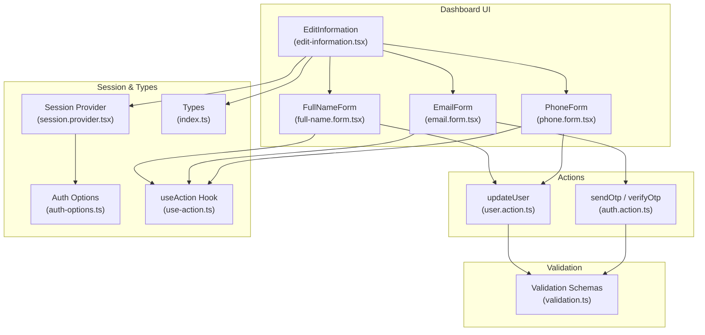
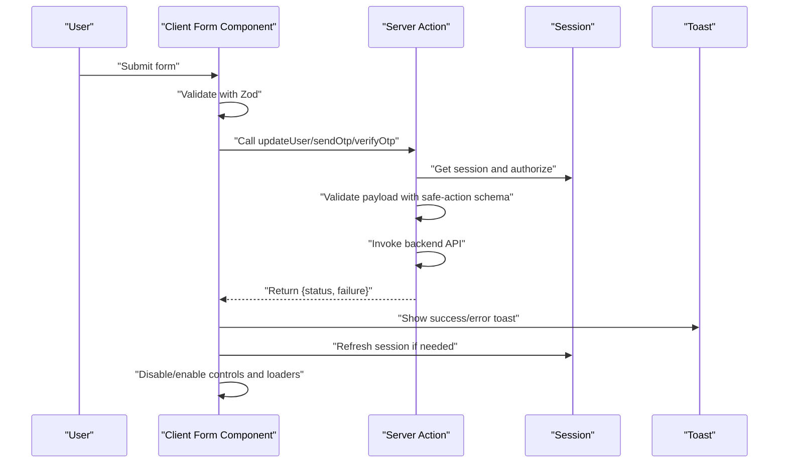
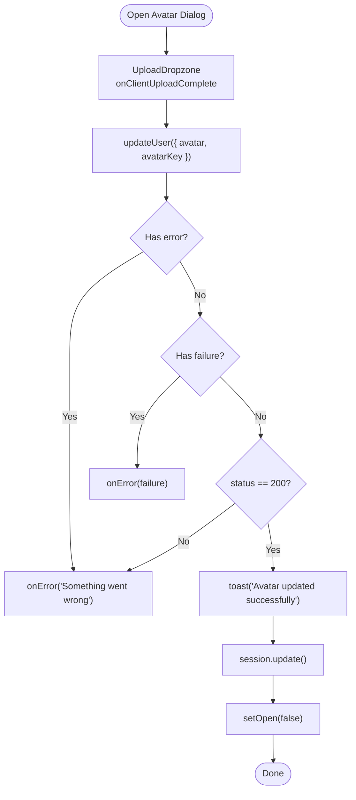
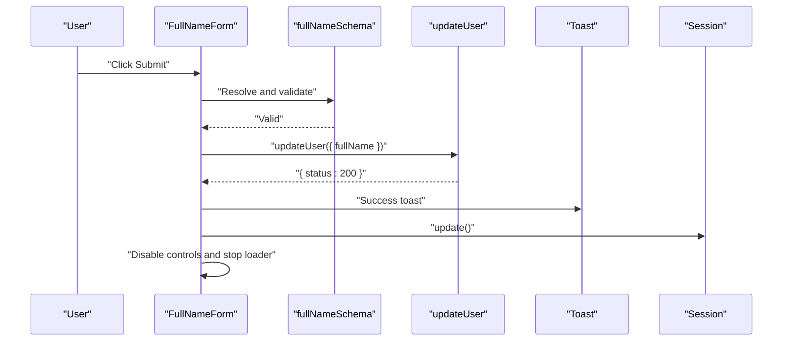
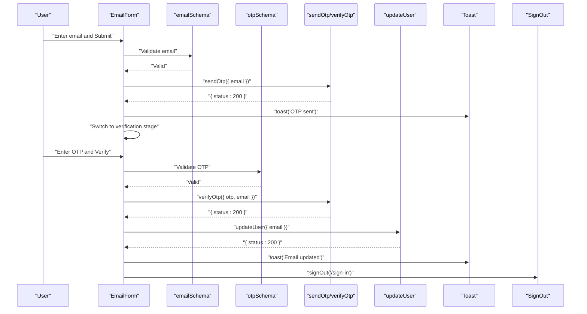
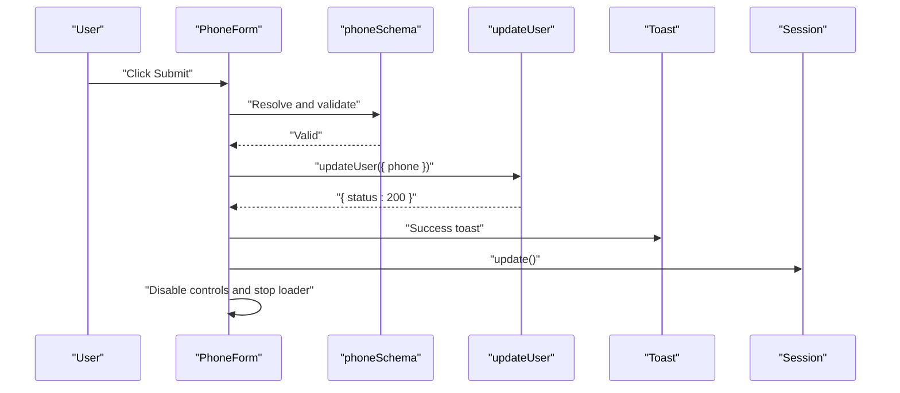
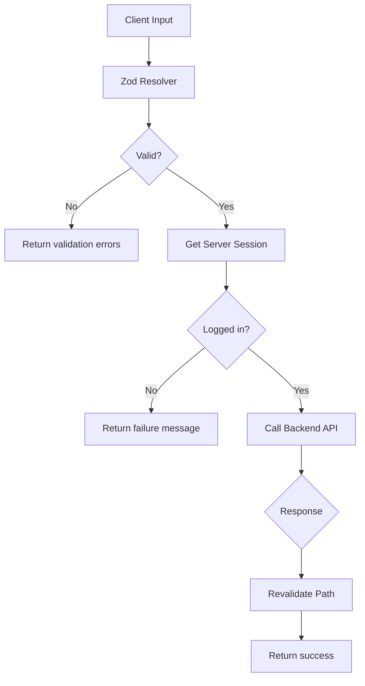
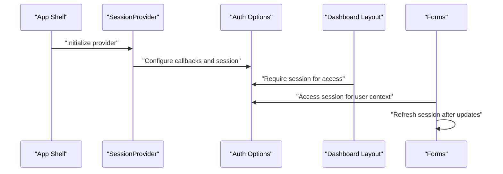
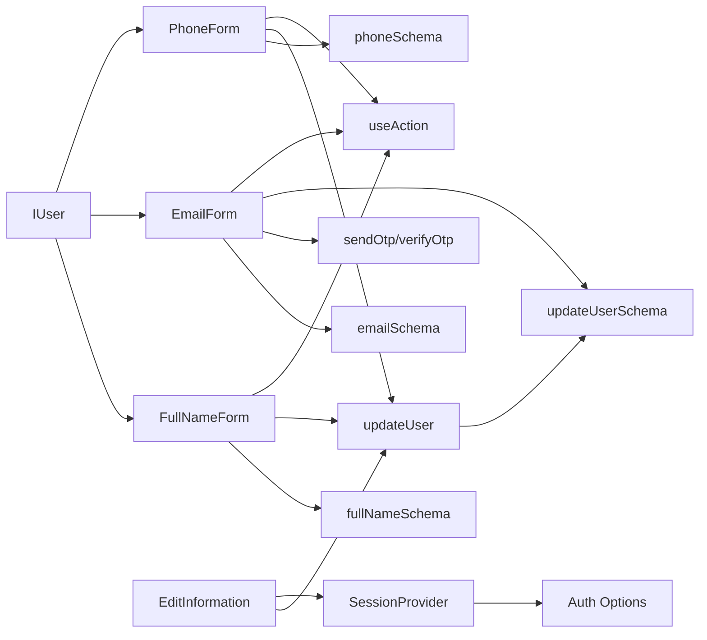

# Personal Information Management

<cite>
**Referenced Files in This Document**
- [edit-information.tsx](file://app/dashboard/_components/edit-information.tsx)
- [full-name.form.tsx](file://app/dashboard/_components/full-name.form.tsx)
- [email.form.tsx](file://app/dashboard/_components/email.form.tsx)
- [phone.form.tsx](file://app/dashboard/_components/phone.form.tsx)
- [user.action.ts](file://actions/user.action.ts)
- [auth.action.ts](file://actions/auth.action.ts)
- [validation.ts](file://lib/validation.ts)
- [use-action.ts](file://hooks/use-action.ts)
- [index.ts](file://types/index.ts)
- [layout.tsx](file://app/dashboard/layout.tsx)
- [session.provider.tsx](file://components/providers/session.provider.tsx)
- [auth-options.ts](file://lib/auth-options.ts)
</cite>

## Table of Contents
1. [Introduction](#introduction)
2. [Project Structure](#project-structure)
3. [Core Components](#core-components)
4. [Architecture Overview](#architecture-overview)
5. [Detailed Component Analysis](#detailed-component-analysis)
6. [Dependency Analysis](#dependency-analysis)
7. [Performance Considerations](#performance-considerations)
8. [Troubleshooting Guide](#troubleshooting-guide)
9. [Conclusion](#conclusion)

## Introduction
This document describes the personal information management system focused on profile editing. It covers the full name, email, and phone number update interfaces, form validation patterns, error handling, user feedback mechanisms, server-side integration for secure updates, loading states, success/error notifications, component architecture, individual form handlers, and data synchronization. It also documents user session integration, permission checks, and data persistence strategies, along with UX patterns for inline editing and validation error display.

## Project Structure
The personal information management feature resides under the dashboard application and is composed of:
- A container component that renders profile header, avatar controls, and an accordion of editable sections
- Individual form components for full name, email, and phone number
- Server actions for secure profile updates and OTP-based email verification
- Validation schemas for form inputs
- Shared hooks for loading/error states and toast notifications
- Types for user data and action responses
- Session integration for permissions and user context

**Diagram sources**
- [edit-information.tsx:1-199](file://app/dashboard/_components/edit-information.tsx#L1-L199)
- [full-name.form.tsx:1-88](file://app/dashboard/_components/full-name.form.tsx#L1-L88)
- [email.form.tsx:1-186](file://app/dashboard/_components/email.form.tsx#L1-L186)
- [phone.form.tsx:1-88](file://app/dashboard/_components/phone.form.tsx#L1-L88)
- [user.action.ts:244-260](file://actions/user.action.ts#L244-L260)
- [auth.action.ts](file://actions/auth.action.ts)
- [validation.ts:26-39](file://lib/validation.ts#L26-L39)
- [session.provider.tsx:1-39](file://components/providers/session.provider.tsx#L1-L39)
- [auth-options.ts:1-128](file://lib/auth-options.ts#L1-L128)
- [index.ts:153-169](file://types/index.ts#L153-L169)
- [use-action.ts:1-16](file://hooks/use-action.ts#L1-L16)

**Section sources**
- [edit-information.tsx:1-199](file://app/dashboard/_components/edit-information.tsx#L1-L199)
- [full-name.form.tsx:1-88](file://app/dashboard/_components/full-name.form.tsx#L1-L88)
- [email.form.tsx:1-186](file://app/dashboard/_components/email.form.tsx#L1-L186)
- [phone.form.tsx:1-88](file://app/dashboard/_components/phone.form.tsx#L1-L88)
- [user.action.ts:244-260](file://actions/user.action.ts#L244-L260)
- [auth.action.ts](file://actions/auth.action.ts)
- [validation.ts:26-39](file://lib/validation.ts#L26-L39)
- [session.provider.tsx:1-39](file://components/providers/session.provider.tsx#L1-L39)
- [auth-options.ts:1-128](file://lib/auth-options.ts#L1-L128)
- [index.ts:153-169](file://types/index.ts#L153-L169)
- [use-action.ts:1-16](file://hooks/use-action.ts#L1-L16)

## Core Components
- EditInformation: Renders profile header, avatar upload dialog, and an accordion with three editable sections (full name, email, phone). Manages avatar updates via server action and session refresh.
- FullNameForm: Full name inline editor with Zod validation, controlled submission, loading state, and success notification.
- EmailForm: Dual-stage email editor with OTP generation and verification, then profile update and sign-out redirection.
- PhoneForm: Phone number inline editor with Zod validation, controlled submission, loading state, and success notification.
- updateUser action: Secure server action that validates inputs, authenticates via session, updates profile, and revalidates the dashboard path.
- Validation schemas: fullNameSchema, emailSchema, phoneSchema, and updateUserSchema define input constraints.
- useAction hook: Centralized loading state and error notification handler.
- Types: IUser defines user shape used across forms and components.

**Section sources**
- [edit-information.tsx:36-196](file://app/dashboard/_components/edit-information.tsx#L36-L196)
- [full-name.form.tsx:28-85](file://app/dashboard/_components/full-name.form.tsx#L28-L85)
- [email.form.tsx:35-183](file://app/dashboard/_components/email.form.tsx#L35-L183)
- [phone.form.tsx:28-85](file://app/dashboard/_components/phone.form.tsx#L28-L85)
- [user.action.ts:244-260](file://actions/user.action.ts#L244-L260)
- [validation.ts:26-39](file://lib/validation.ts#L26-L39)
- [use-action.ts:4-12](file://hooks/use-action.ts#L4-L12)
- [index.ts:153-169](file://types/index.ts#L153-L169)

## Architecture Overview
The system follows a client-component-first pattern with server actions for sensitive operations:
- Client components manage UI state, validation, and loading indicators.
- Server actions enforce authentication, validate inputs, call backend APIs, and handle revalidation.
- Session integration ensures user context is available for permission checks and profile updates.
- Toast notifications provide user feedback for success and error scenarios.

**Diagram sources**
- [full-name.form.tsx:37-51](file://app/dashboard/_components/full-name.form.tsx#L37-L51)
- [email.form.tsx:51-102](file://app/dashboard/_components/email.form.tsx#L51-L102)
- [phone.form.tsx:37-51](file://app/dashboard/_components/phone.form.tsx#L37-L51)
- [user.action.ts:244-260](file://actions/user.action.ts#L244-L260)
- [auth.action.ts](file://actions/auth.action.ts)
- [use-action.ts:7-10](file://hooks/use-action.ts#L7-L10)

## Detailed Component Analysis

### EditInformation Component
Responsibilities:
- Renders profile header with avatar and gradient background.
- Provides avatar upload dialog with UploadThing integration.
- Manages avatar update via updateUser action and session refresh.
- Hosts an accordion with three editable sections: full name, email, phone.
- Displays current values and handles loading states during avatar uploads.

Key behaviors:
- Avatar upload triggers server action with URL and key; success updates session and closes dialog.
- Loading overlay prevents interaction during avatar upload.
- Uses motion animations for interactive elements.

**Diagram sources**
- [edit-information.tsx:42-57](file://app/dashboard/_components/edit-information.tsx#L42-L57)
- [user.action.ts:244-260](file://actions/user.action.ts#L244-L260)
- [use-action.ts:7-10](file://hooks/use-action.ts#L7-L10)

**Section sources**
- [edit-information.tsx:36-196](file://app/dashboard/_components/edit-information.tsx#L36-L196)

### FullNameForm Component
Responsibilities:
- Validates full name against fullNameSchema.
- Submits updates via updateUser action.
- Handles loading state, error notifications, and session refresh on success.

UX patterns:
- Controlled input with disabled state during submission.
- Inline validation messages via FormMessage.
- Success toast and session update after successful save.

**Diagram sources**
- [full-name.form.tsx:32-51](file://app/dashboard/_components/full-name.form.tsx#L32-L51)
- [validation.ts:26-30](file://lib/validation.ts#L26-L30)
- [user.action.ts:244-260](file://actions/user.action.ts#L244-L260)

**Section sources**
- [full-name.form.tsx:28-85](file://app/dashboard/_components/full-name.form.tsx#L28-L85)
- [validation.ts:26-30](file://lib/validation.ts#L26-L30)

### EmailForm Component
Responsibilities:
- Validates email against emailSchema.
- Sends OTP via sendOtp action.
- Verifies OTP via verifyOtp action.
- On successful verification, updates email via updateUser action.
- Redirects to sign-in after email change.

Workflow:
- Initial stage: submit email to trigger OTP sending.
- Verification stage: enter 6-digit OTP and verify.
- On success: update profile and sign out to force re-authentication with new email.

**Diagram sources**
- [email.form.tsx:51-102](file://app/dashboard/_components/email.form.tsx#L51-L102)
- [validation.ts:32-34](file://lib/validation.ts#L32-L34)
- [validation.ts:13-15](file://lib/validation.ts#L13-L15)
- [auth.action.ts](file://actions/auth.action.ts)
- [user.action.ts:244-260](file://actions/user.action.ts#L244-L260)

**Section sources**
- [email.form.tsx:35-183](file://app/dashboard/_components/email.form.tsx#L35-L183)
- [validation.ts:32-34](file://lib/validation.ts#L32-L34)
- [validation.ts:13-15](file://lib/validation.ts#L13-L15)

### PhoneForm Component
Responsibilities:
- Validates phone number against phoneSchema.
- Submits updates via updateUser action.
- Handles loading state, error notifications, and session refresh on success.

UX patterns:
- Controlled input with disabled state during submission.
- Inline validation messages via FormMessage.
- Success toast and session update after successful save.

**Diagram sources**
- [phone.form.tsx:32-51](file://app/dashboard/_components/phone.form.tsx#L32-L51)
- [validation.ts:35-39](file://lib/validation.ts#L35-L39)
- [user.action.ts:244-260](file://actions/user.action.ts#L244-L260)

**Section sources**
- [phone.form.tsx:28-85](file://app/dashboard/_components/phone.form.tsx#L28-L85)
- [validation.ts:35-39](file://lib/validation.ts#L35-L39)

### Server Actions and Data Persistence
- updateUser action:
  - Requires authenticated session.
  - Validates payload with updateUserSchema.
  - Calls backend API to update profile.
  - Revalidates dashboard path to reflect changes.
- Validation integration:
  - Zod schemas in client forms align with updateUserSchema on the server.
- Persistence:
  - Backend persists updates; session refresh ensures UI reflects changes immediately.

**Diagram sources**
- [user.action.ts:244-260](file://actions/user.action.ts#L244-L260)
- [validation.ts:83-91](file://lib/validation.ts#L83-L91)

**Section sources**
- [user.action.ts:244-260](file://actions/user.action.ts#L244-L260)
- [validation.ts:83-91](file://lib/validation.ts#L83-L91)

### Session Integration and Permission Checks
- SessionProvider wraps the app and manages OAuth auto-login flow.
- Auth options define JWT/session strategies, callbacks to enrich session with user data, and cookie policies.
- Dashboard layout enforces authentication by redirecting unauthenticated users.
- Forms check session for current user context and refresh session after successful updates.

**Diagram sources**
- [session.provider.tsx:31-38](file://components/providers/session.provider.tsx#L31-L38)
- [auth-options.ts:69-121](file://lib/auth-options.ts#L69-L121)
- [layout.tsx:11-14](file://app/dashboard/layout.tsx#L11-L14)

**Section sources**
- [session.provider.tsx:1-39](file://components/providers/session.provider.tsx#L1-L39)
- [auth-options.ts:1-128](file://lib/auth-options.ts#L1-L128)
- [layout.tsx:1-45](file://app/dashboard/layout.tsx#L1-L45)

## Dependency Analysis
- Client components depend on:
  - Zod schemas for validation
  - Server actions for secure updates
  - useAction hook for loading/error handling
  - NextAuth session for user context
- Server actions depend on:
  - Safe action client for schema enforcement
  - Backend API via axios client
  - NextAuth session for permission checks
- Types define the contract for user data and action responses.

**Diagram sources**
- [full-name.form.tsx:16-23](file://app/dashboard/_components/full-name.form.tsx#L16-L23)
- [email.form.tsx:23-30](file://app/dashboard/_components/email.form.tsx#L23-L30)
- [phone.form.tsx:16-23](file://app/dashboard/_components/phone.form.tsx#L16-L23)
- [user.action.ts:244-260](file://actions/user.action.ts#L244-L260)
- [validation.ts:26-39](file://lib/validation.ts#L26-L39)
- [use-action.ts:1-16](file://hooks/use-action.ts#L1-L16)
- [edit-information.tsx:24-29](file://app/dashboard/_components/edit-information.tsx#L24-L29)
- [session.provider.tsx:1-39](file://components/providers/session.provider.tsx#L1-L39)
- [auth-options.ts:1-128](file://lib/auth-options.ts#L1-L128)
- [index.ts:153-169](file://types/index.ts#L153-L169)

**Section sources**
- [full-name.form.tsx:1-88](file://app/dashboard/_components/full-name.form.tsx#L1-L88)
- [email.form.tsx:1-186](file://app/dashboard/_components/email.form.tsx#L1-L186)
- [phone.form.tsx:1-88](file://app/dashboard/_components/phone.form.tsx#L1-L88)
- [user.action.ts:244-260](file://actions/user.action.ts#L244-L260)
- [validation.ts:26-39](file://lib/validation.ts#L26-L39)
- [use-action.ts:1-16](file://hooks/use-action.ts#L1-L16)
- [edit-information.tsx:1-199](file://app/dashboard/_components/edit-information.tsx#L1-L199)
- [session.provider.tsx:1-39](file://components/providers/session.provider.tsx#L1-L39)
- [auth-options.ts:1-128](file://lib/auth-options.ts#L1-L128)
- [index.ts:153-169](file://types/index.ts#L153-L169)

## Performance Considerations
- Minimize re-renders by disabling form controls during submission and using local loading state.
- Use targeted revalidation for the dashboard path after profile updates to avoid unnecessary cache invalidation.
- Debounce or throttle frequent updates where applicable.
- Keep validation schemas concise and aligned between client and server to reduce mismatch overhead.

## Troubleshooting Guide
Common issues and resolutions:
- Validation errors:
  - Ensure client Zod schemas match server schemas.
  - Use FormMessage to surface validation errors to users.
- Authentication failures:
  - Confirm session exists before invoking server actions.
  - Use dashboard layout’s redirect to sign-in for unauthenticated users.
- OTP-related issues:
  - Verify OTP expiration and resend logic.
  - On OTP expiry, prompt resend and notify user.
- Avatar upload failures:
  - Check server response for failure messages and display via onError.
  - Ensure UploadThing endpoint configuration matches client invocation.

**Section sources**
- [use-action.ts:7-10](file://hooks/use-action.ts#L7-L10)
- [layout.tsx:11-14](file://app/dashboard/layout.tsx#L11-L14)
- [email.form.tsx:80-84](file://app/dashboard/_components/email.form.tsx#L80-L84)
- [edit-information.tsx:42-57](file://app/dashboard/_components/edit-information.tsx#L42-L57)

## Conclusion
The personal information management system combines robust client-side validation, secure server actions, and seamless session integration to deliver a reliable and user-friendly profile editing experience. The modular component architecture, centralized error handling, and clear data synchronization patterns support maintainability and scalability.