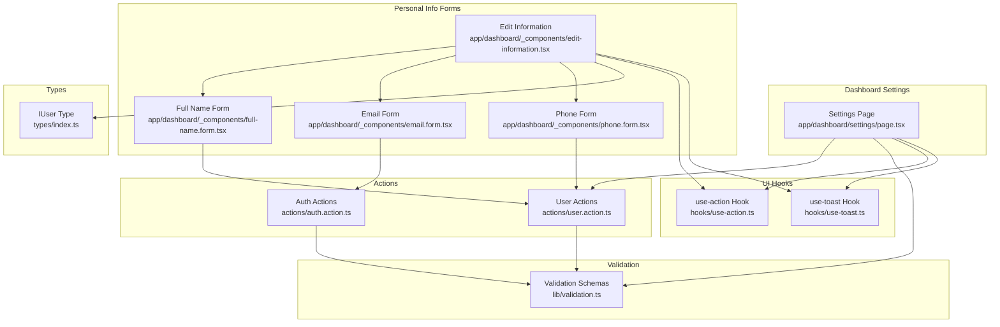
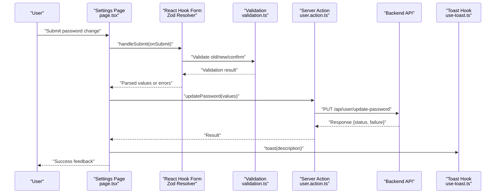
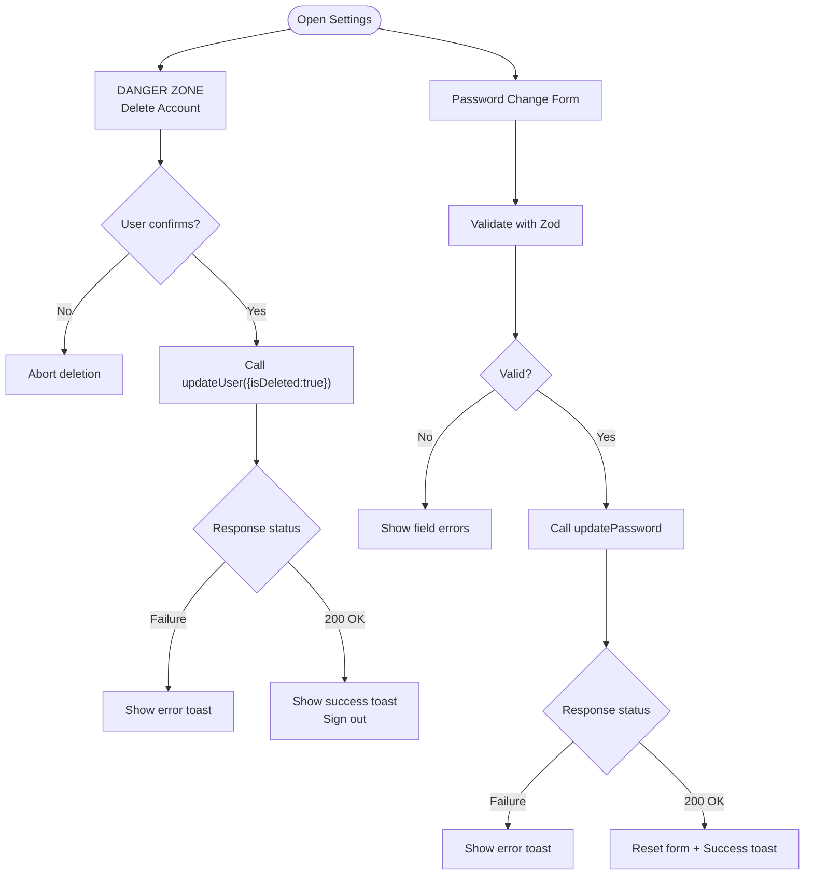
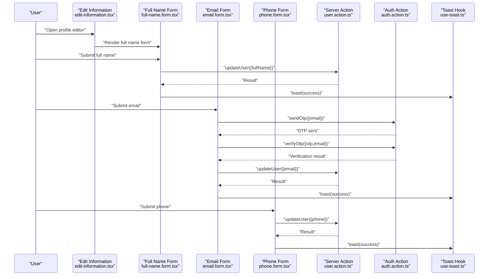
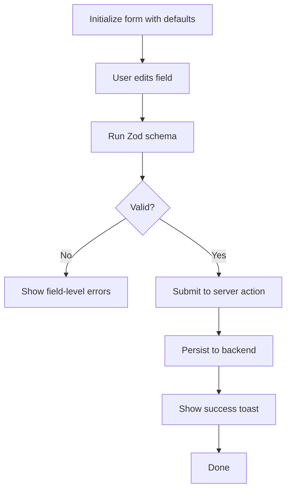
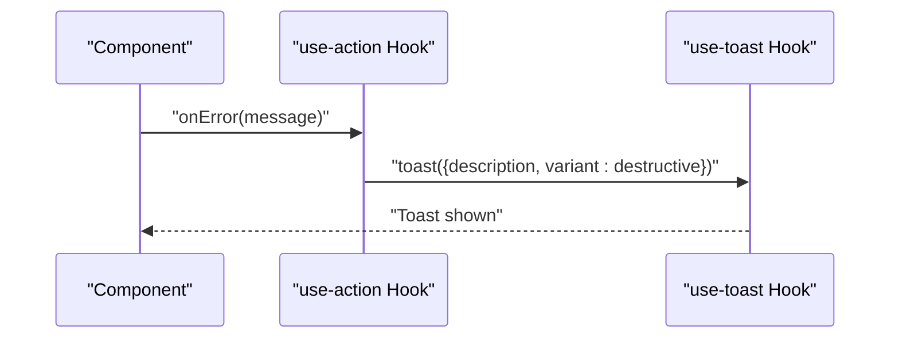
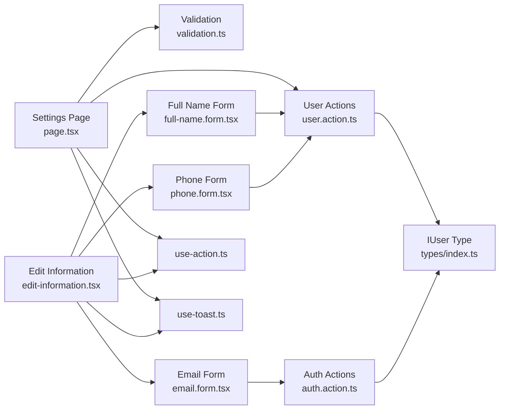

# Settings and Preferences

<cite>
**Referenced Files in This Document**
- [page.tsx](file://app/dashboard/settings/page.tsx)
- [user.action.ts](file://actions/user.action.ts)
- [validation.ts](file://lib/validation.ts)
- [edit-information.tsx](file://app/dashboard/_components/edit-information.tsx)
- [full-name.form.tsx](file://app/dashboard/_components/full-name.form.tsx)
- [email.form.tsx](file://app/dashboard/_components/email.form.tsx)
- [phone.form.tsx](file://app/dashboard/_components/phone.form.tsx)
- [auth.action.ts](file://actions/auth.action.ts)
- [types/index.ts](file://types/index.ts)
- [use-action.ts](file://hooks/use-action.ts)
- [use-toast.ts](file://hooks/use-toast.ts)
- [constants.ts](file://lib/constants.ts)
</cite>

## Table of Contents
1. [Introduction](#introduction)
2. [Project Structure](#project-structure)
3. [Core Components](#core-components)
4. [Architecture Overview](#architecture-overview)
5. [Detailed Component Analysis](#detailed-component-analysis)
6. [Dependency Analysis](#dependency-analysis)
7. [Performance Considerations](#performance-considerations)
8. [Troubleshooting Guide](#troubleshooting-guide)
9. [Conclusion](#conclusion)
10. [Appendices](#appendices)

## Introduction
This document describes the user settings and preferences management system. It covers the settings interface layout, preference categories, and customization options. It also documents the settings form architecture, validation patterns, save mechanisms, integration with user profile data, preference persistence, and settings synchronization. Categories addressed include personal information updates (name, email, phone), password change, and account deletion. Additional topics include validation patterns, error handling, user feedback, default value management, and reset capabilities.

## Project Structure
The settings system spans client-side pages, reusable form components, server actions, validation schemas, and UI primitives. The primary settings page is located under the dashboard, with supporting forms for personal information and authentication-related changes.

**Diagram sources**
- [page.tsx:1-154](file://app/dashboard/settings/page.tsx#L1-L154)
- [edit-information.tsx:1-199](file://app/dashboard/_components/edit-information.tsx#L1-L199)
- [full-name.form.tsx:1-88](file://app/dashboard/_components/full-name.form.tsx#L1-L88)
- [email.form.tsx:1-186](file://app/dashboard/_components/email.form.tsx#L1-L186)
- [phone.form.tsx:1-88](file://app/dashboard/_components/phone.form.tsx#L1-L88)
- [user.action.ts:1-297](file://actions/user.action.ts#L1-L297)
- [auth.action.ts:1-51](file://actions/auth.action.ts#L1-L51)
- [validation.ts:1-96](file://lib/validation.ts#L1-L96)
- [use-action.ts:1-16](file://hooks/use-action.ts#L1-L16)
- [use-toast.ts:1-192](file://hooks/use-toast.ts#L1-L192)
- [types/index.ts:153-169](file://types/index.ts#L153-L169)

**Section sources**
- [page.tsx:1-154](file://app/dashboard/settings/page.tsx#L1-L154)
- [edit-information.tsx:1-199](file://app/dashboard/_components/edit-information.tsx#L1-L199)
- [full-name.form.tsx:1-88](file://app/dashboard/_components/full-name.form.tsx#L1-L88)
- [email.form.tsx:1-186](file://app/dashboard/_components/email.form.tsx#L1-L186)
- [phone.form.tsx:1-88](file://app/dashboard/_components/phone.form.tsx#L1-L88)
- [user.action.ts:1-297](file://actions/user.action.ts#L1-L297)
- [auth.action.ts:1-51](file://actions/auth.action.ts#L1-L51)
- [validation.ts:1-96](file://lib/validation.ts#L1-L96)
- [use-action.ts:1-16](file://hooks/use-action.ts#L1-L16)
- [use-toast.ts:1-192](file://hooks/use-toast.ts#L1-L192)
- [types/index.ts:153-169](file://types/index.ts#L153-L169)

## Core Components
- Settings page: Hosts the password change form and account deletion controls. Uses Zod validation, React Hook Form, and server actions for persistence.
- Personal information editing: A collapsible accordion-style editor with three editable fields (full name, email, phone), each backed by dedicated forms and validation schemas.
- Server actions: Encapsulate backend communication for updating profile fields, changing passwords, and deleting accounts.
- Validation schemas: Define shape and constraints for all user inputs, including defaults and cross-field checks.
- UI hooks: Provide loading state, error handling, and toast notifications.

Key responsibilities:
- Password change: Validates old/new/confirm fields, posts to server, and resets form on success.
- Account deletion: Confirms via dialog, marks user as deleted, and signs out.
- Profile updates: Full name, email, and phone updates with real-time session refresh and user feedback.
- Email change flow: OTP-based verification before persisting the new email and signing out.

**Section sources**
- [page.tsx:29-151](file://app/dashboard/settings/page.tsx#L29-L151)
- [edit-information.tsx:36-195](file://app/dashboard/_components/edit-information.tsx#L36-L195)
- [full-name.form.tsx:28-51](file://app/dashboard/_components/full-name.form.tsx#L28-L51)
- [email.form.tsx:35-102](file://app/dashboard/_components/email.form.tsx#L35-L102)
- [phone.form.tsx:28-51](file://app/dashboard/_components/phone.form.tsx#L28-L51)
- [user.action.ts:245-278](file://actions/user.action.ts#L245-L278)
- [auth.action.ts:27-39](file://actions/auth.action.ts#L27-L39)
- [validation.ts:58-73](file://lib/validation.ts#L58-L73)
- [use-action.ts:4-12](file://hooks/use-action.ts#L4-L12)
- [use-toast.ts:142-169](file://hooks/use-toast.ts#L142-L169)

## Architecture Overview
The settings system follows a layered pattern:
- Client pages/components orchestrate user interactions and manage local state.
- React Hook Form validates inputs against Zod schemas and prepares payloads.
- Server actions handle authentication, authorization, and persistence.
- UI hooks centralize error handling and user feedback.
- Types define the shape of user data and API responses.

**Diagram sources**
- [page.tsx:53-67](file://app/dashboard/settings/page.tsx#L53-L67)
- [validation.ts:58-73](file://lib/validation.ts#L58-L73)
- [user.action.ts:263-278](file://actions/user.action.ts#L263-L278)
- [use-toast.ts:142-169](file://hooks/use-toast.ts#L142-L169)

## Detailed Component Analysis

### Settings Page (Password Change and Account Deletion)
- Layout: Two major sections — a danger zone for account deletion and a form for password change.
- Password change form:
  - Fields: Old password, new password, confirm password.
  - Validation: Zod schema enforces minimum length and cross-field equality.
  - Submission: Calls server action to update password; resets form and shows success toast on success.
- Account deletion:
  - Confirmation dialog precedes destructive action.
  - Marks user as deleted and triggers sign-out after successful deletion.

**Diagram sources**
- [page.tsx:37-67](file://app/dashboard/settings/page.tsx#L37-L67)
- [validation.ts:58-73](file://lib/validation.ts#L58-L73)
- [user.action.ts:245-261](file://actions/user.action.ts#L245-L261)
- [use-toast.ts:142-169](file://hooks/use-toast.ts#L142-L169)

**Section sources**
- [page.tsx:29-151](file://app/dashboard/settings/page.tsx#L29-L151)
- [validation.ts:58-73](file://lib/validation.ts#L58-L73)
- [user.action.ts:245-278](file://actions/user.action.ts#L245-L278)
- [use-action.ts:4-12](file://hooks/use-action.ts#L4-L12)
- [use-toast.ts:142-169](file://hooks/use-toast.ts#L142-L169)

### Personal Information Editor (Full Name, Email, Phone)
- Collapsible accordion layout with three sections:
  - Full name: Edits user’s full name with validation and immediate session refresh.
  - Email: Two-step process — request OTP, then verify OTP, then persist email and sign out.
  - Phone: Edits phone number with country-specific format validation.
- Shared behavior:
  - Zod validation per field.
  - Loading state and error handling via a shared hook.
  - Success feedback via toast; session refresh on successful updates.

**Diagram sources**
- [edit-information.tsx:36-195](file://app/dashboard/_components/edit-information.tsx#L36-L195)
- [full-name.form.tsx:28-51](file://app/dashboard/_components/full-name.form.tsx#L28-L51)
- [email.form.tsx:35-102](file://app/dashboard/_components/email.form.tsx#L35-L102)
- [phone.form.tsx:28-51](file://app/dashboard/_components/phone.form.tsx#L28-L51)
- [user.action.ts:245-261](file://actions/user.action.ts#L245-L261)
- [auth.action.ts:27-39](file://actions/auth.action.ts#L27-L39)
- [use-toast.ts:142-169](file://hooks/use-toast.ts#L142-L169)

**Section sources**
- [edit-information.tsx:36-195](file://app/dashboard/_components/edit-information.tsx#L36-L195)
- [full-name.form.tsx:28-51](file://app/dashboard/_components/full-name.form.tsx#L28-L51)
- [email.form.tsx:35-102](file://app/dashboard/_components/email.form.tsx#L35-L102)
- [phone.form.tsx:28-51](file://app/dashboard/_components/phone.form.tsx#L28-L51)
- [user.action.ts:245-261](file://actions/user.action.ts#L245-L261)
- [auth.action.ts:27-39](file://actions/auth.action.ts#L27-L39)
- [use-action.ts:4-12](file://hooks/use-action.ts#L4-L12)
- [use-toast.ts:142-169](file://hooks/use-toast.ts#L142-L169)

### Validation Patterns and Defaults
- Password change:
  - Enforces minimum length for old/new/confirm fields.
  - Cross-field refinement ensures new password equals confirm password.
  - Default values initialized in the form to avoid empty initial state.
- Full name:
  - Minimum length requirement enforced.
- Email:
  - Standardized email format validation.
  - OTP length enforced to six digits.
- Phone:
  - Strict format validation for a specific international pattern.
- Defaults:
  - Forms initialize with current user values to support quick edits and reset scenarios.

**Diagram sources**
- [validation.ts:58-73](file://lib/validation.ts#L58-L73)
- [full-name.form.tsx:32-35](file://app/dashboard/_components/full-name.form.tsx#L32-L35)
- [email.form.tsx:41-49](file://app/dashboard/_components/email.form.tsx#L41-L49)
- [phone.form.tsx:32-35](file://app/dashboard/_components/phone.form.tsx#L32-L35)
- [page.tsx:32-35](file://app/dashboard/settings/page.tsx#L32-L35)

**Section sources**
- [validation.ts:17-39](file://lib/validation.ts#L17-L39)
- [validation.ts:58-73](file://lib/validation.ts#L58-L73)
- [full-name.form.tsx:32-35](file://app/dashboard/_components/full-name.form.tsx#L32-L35)
- [email.form.tsx:41-49](file://app/dashboard/_components/email.form.tsx#L41-L49)
- [phone.form.tsx:32-35](file://app/dashboard/_components/phone.form.tsx#L32-L35)
- [page.tsx:32-35](file://app/dashboard/settings/page.tsx#L32-L35)

### Error Handling and User Feedback
- Centralized error handling:
  - A shared hook manages loading state and displays error toasts on failures.
- User feedback:
  - Success toasts confirm each operation (password change, profile updates, email change, avatar update).
- Session synchronization:
  - On successful profile updates, the session is refreshed to reflect new data immediately in the UI.

**Diagram sources**
- [use-action.ts:4-12](file://hooks/use-action.ts#L4-L12)
- [use-toast.ts:142-169](file://hooks/use-toast.ts#L142-L169)

**Section sources**
- [use-action.ts:4-12](file://hooks/use-action.ts#L4-L12)
- [use-toast.ts:142-169](file://hooks/use-toast.ts#L142-L169)
- [edit-information.tsx:42-57](file://app/dashboard/_components/edit-information.tsx#L42-L57)
- [full-name.form.tsx:37-51](file://app/dashboard/_components/full-name.form.tsx#L37-L51)
- [email.form.tsx:51-66](file://app/dashboard/_components/email.form.tsx#L51-L66)
- [phone.form.tsx:37-51](file://app/dashboard/_components/phone.form.tsx#L37-L51)

### Settings Categories and Options
- Notification preferences: Not present in the current codebase snapshot.
- Account settings:
  - Password change: Enforced by validation and server action.
  - Account deletion: Destructive action with confirmation dialog.
- Security preferences:
  - Email change requires OTP verification before persisting.
- Display options: Not present in the current codebase snapshot.
- Personal information:
  - Full name, email, phone with validation and persistence.

Note: The settings page currently focuses on password change and account deletion, and the personal information editor focuses on name, email, and phone. Notification and display preferences are not implemented in the referenced files.

**Section sources**
- [page.tsx:29-151](file://app/dashboard/settings/page.tsx#L29-L151)
- [edit-information.tsx:134-191](file://app/dashboard/_components/edit-information.tsx#L134-L191)
- [email.form.tsx:35-102](file://app/dashboard/_components/email.form.tsx#L35-L102)
- [user.action.ts:245-278](file://actions/user.action.ts#L245-L278)

### Settings Import/Export and Reset Capabilities
- Import/export: Not implemented in the current codebase snapshot.
- Reset capabilities:
  - Forms initialize with current user values, enabling a “reset” to defaults by canceling edits.
  - Password change form resets after successful submission.

**Section sources**
- [full-name.form.tsx:32-35](file://app/dashboard/_components/full-name.form.tsx#L32-L35)
- [email.form.tsx:41-49](file://app/dashboard/_components/email.form.tsx#L41-L49)
- [phone.form.tsx:32-35](file://app/dashboard/_components/phone.form.tsx#L32-L35)
- [page.tsx:62-66](file://app/dashboard/settings/page.tsx#L62-L66)

## Dependency Analysis
- Client components depend on:
  - Zod schemas for validation.
  - Server actions for persistence.
  - UI hooks for error handling and feedback.
- Server actions depend on:
  - Authentication session for authorization.
  - Backend APIs for persistence.
- Types define the contract for user data and API responses.

**Diagram sources**
- [page.tsx:1-154](file://app/dashboard/settings/page.tsx#L1-L154)
- [edit-information.tsx:1-199](file://app/dashboard/_components/edit-information.tsx#L1-L199)
- [full-name.form.tsx:1-88](file://app/dashboard/_components/full-name.form.tsx#L1-L88)
- [email.form.tsx:1-186](file://app/dashboard/_components/email.form.tsx#L1-L186)
- [phone.form.tsx:1-88](file://app/dashboard/_components/phone.form.tsx#L1-L88)
- [user.action.ts:1-297](file://actions/user.action.ts#L1-L297)
- [auth.action.ts:1-51](file://actions/auth.action.ts#L1-L51)
- [validation.ts:1-96](file://lib/validation.ts#L1-L96)
- [types/index.ts:153-169](file://types/index.ts#L153-L169)
- [use-action.ts:1-16](file://hooks/use-action.ts#L1-L16)
- [use-toast.ts:1-192](file://hooks/use-toast.ts#L1-L192)

**Section sources**
- [page.tsx:1-154](file://app/dashboard/settings/page.tsx#L1-L154)
- [edit-information.tsx:1-199](file://app/dashboard/_components/edit-information.tsx#L1-L199)
- [user.action.ts:1-297](file://actions/user.action.ts#L1-L297)
- [auth.action.ts:1-51](file://actions/auth.action.ts#L1-L51)
- [validation.ts:1-96](file://lib/validation.ts#L1-L96)
- [types/index.ts:153-169](file://types/index.ts#L153-L169)
- [use-action.ts:1-16](file://hooks/use-action.ts#L1-L16)
- [use-toast.ts:1-192](file://hooks/use-toast.ts#L1-L192)

## Performance Considerations
- Minimize re-renders by initializing forms with current values and resetting only on success.
- Use controlled components with Zod validation to prevent unnecessary submissions.
- Debounce or batch UI updates when multiple fields change concurrently.
- Keep server action payloads minimal to reduce network overhead.

## Troubleshooting Guide
Common issues and resolutions:
- Validation errors:
  - Ensure all fields meet schema requirements (length, format, cross-field equality).
  - Clear previous error messages when switching between forms.
- Server errors:
  - Use the centralized error handler to surface meaningful messages.
  - Confirm session availability before invoking protected actions.
- Email change failures:
  - Verify OTP expiration and resend if needed.
  - Ensure the backend responds with expected status codes.
- Session not updating:
  - Refresh the session after successful profile updates to reflect changes immediately.

**Section sources**
- [use-action.ts:4-12](file://hooks/use-action.ts#L4-L12)
- [use-toast.ts:142-169](file://hooks/use-toast.ts#L142-L169)
- [email.form.tsx:68-102](file://app/dashboard/_components/email.form.tsx#L68-L102)
- [full-name.form.tsx:37-51](file://app/dashboard/_components/full-name.form.tsx#L37-L51)
- [phone.form.tsx:37-51](file://app/dashboard/_components/phone.form.tsx#L37-L51)

## Conclusion
The settings and preferences system provides a robust foundation for managing user credentials and personal information. It leverages Zod for strong validation, React Hook Form for a smooth UX, server actions for secure persistence, and shared hooks for consistent error handling and feedback. While notification and display preferences are not yet implemented, the architecture supports easy extension to additional categories.

## Appendices
- Sidebar navigation includes a dedicated settings route for future expansion.
- Constants define navigation entries for dashboard sections.

**Section sources**
- [constants.ts:13-17](file://lib/constants.ts#L13-L17)