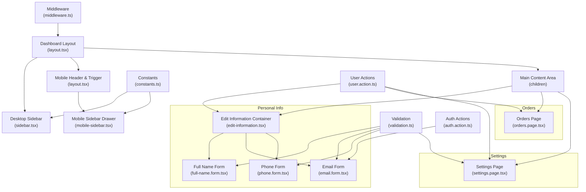
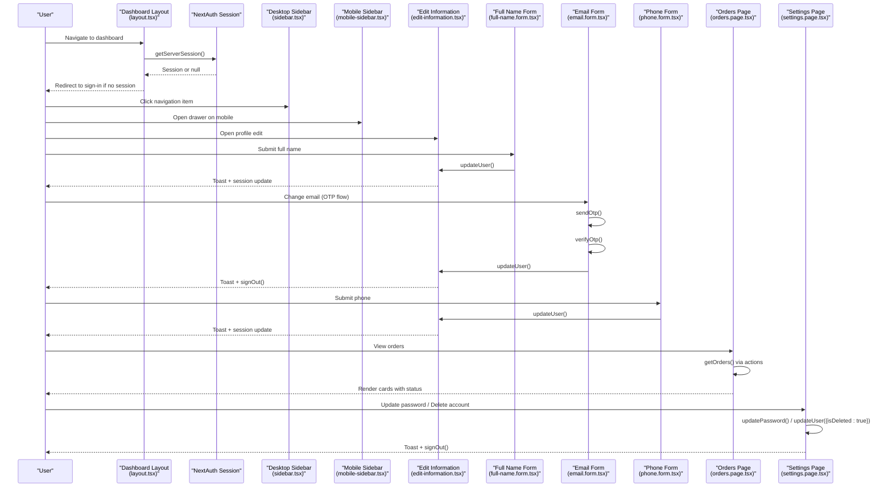
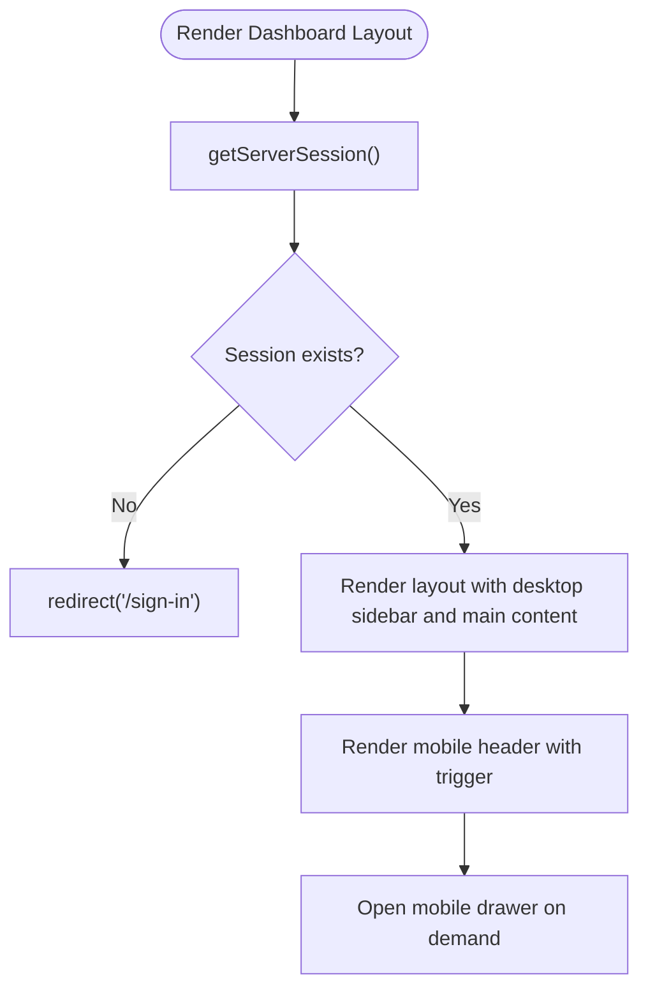
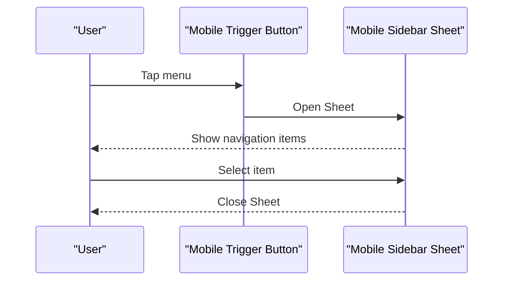
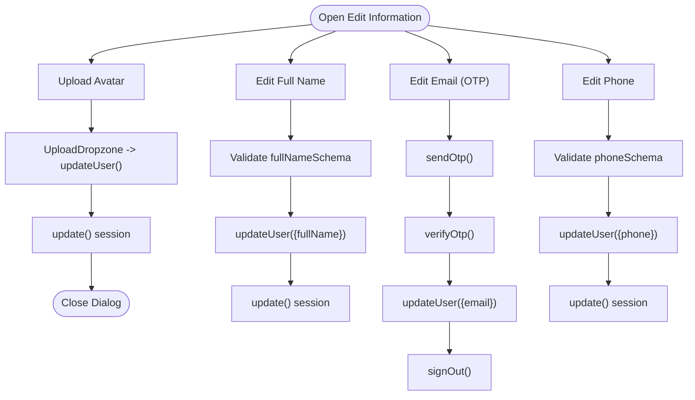
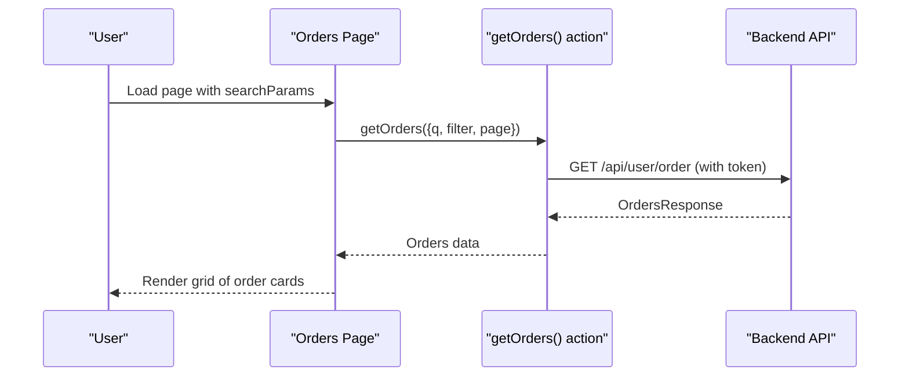
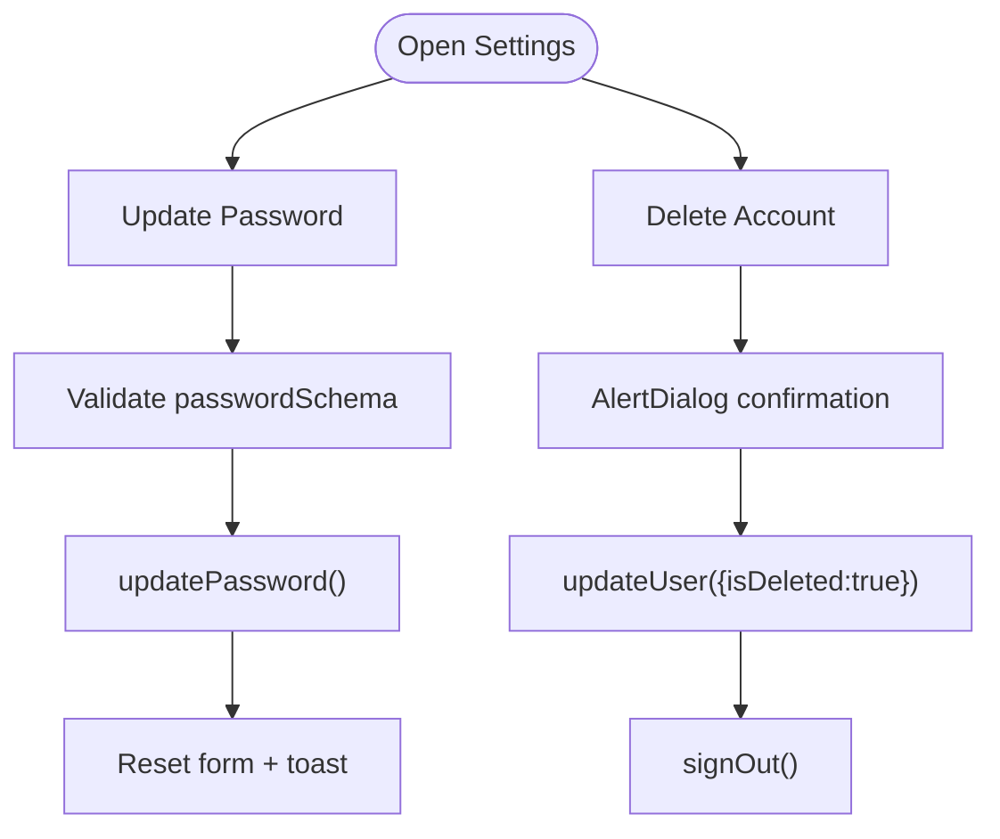
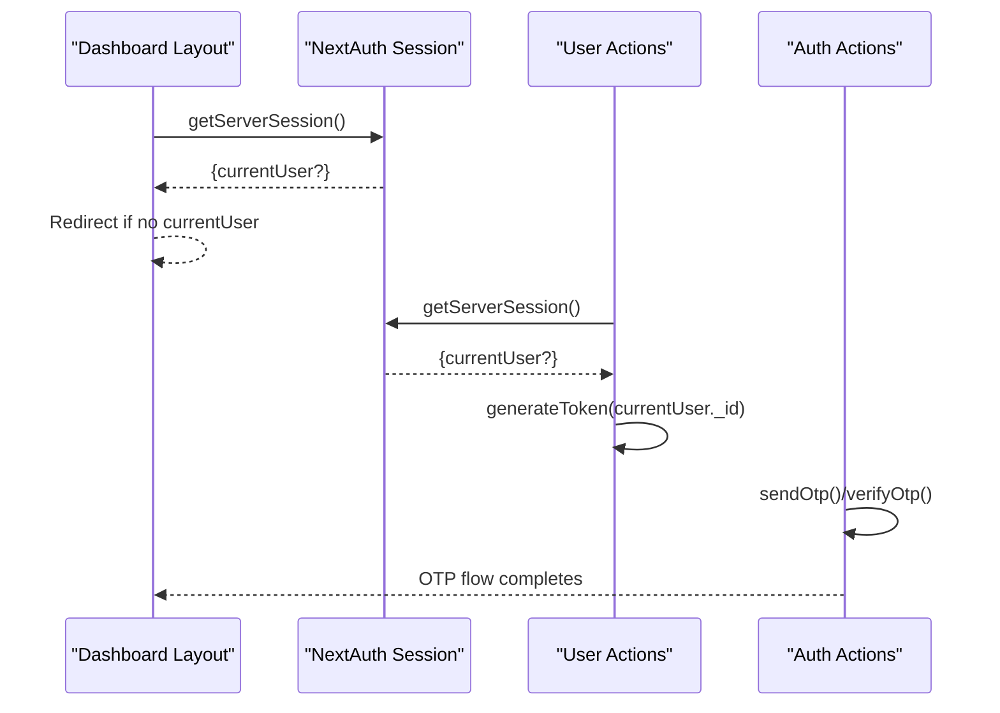
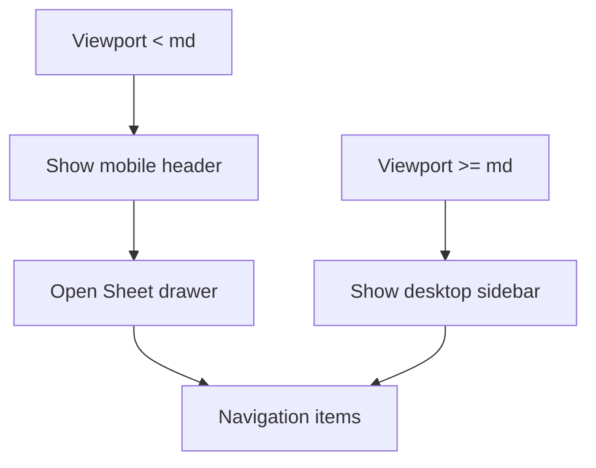
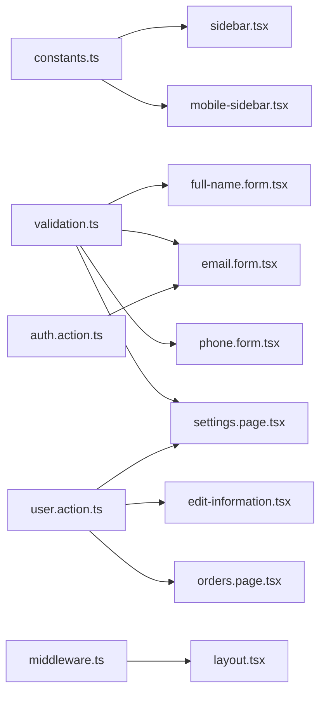

# User Dashboard

<cite>
**Referenced Files in This Document**
- [layout.tsx](file://app/dashboard/layout.tsx)
- [sidebar.tsx](file://app/dashboard/_components/sidebar.tsx)
- [mobile-sidebar.tsx](file://app/dashboard/_components/mobile-sidebar.tsx)
- [edit-information.tsx](file://app/dashboard/_components/edit-information.tsx)
- [full-name.form.tsx](file://app/dashboard/_components/full-name.form.tsx)
- [email.form.tsx](file://app/dashboard/_components/email.form.tsx)
- [phone.form.tsx](file://app/dashboard/_components/phone.form.tsx)
- [orders.page.tsx](file://app/dashboard/orders/page.tsx)
- [settings.page.tsx](file://app/dashboard/settings/page.tsx)
- [constants.ts](file://lib/constants.ts)
- [validation.ts](file://lib/validation.ts)
- [user.action.ts](file://actions/user.action.ts)
- [auth.action.ts](file://actions/auth.action.ts)
- [middleware.ts](file://middleware.ts)
</cite>

## Table of Contents
1. [Introduction](#introduction)
2. [Project Structure](#project-structure)
3. [Core Components](#core-components)
4. [Architecture Overview](#architecture-overview)
5. [Detailed Component Analysis](#detailed-component-analysis)
6. [Dependency Analysis](#dependency-analysis)
7. [Performance Considerations](#performance-considerations)
8. [Troubleshooting Guide](#troubleshooting-guide)
9. [Conclusion](#conclusion)

## Introduction
This document describes the Optim Bozor user dashboard, focusing on layout and navigation, personal information management, order history and status, settings and preferences, mobile sidebar and responsive design, authentication integration, data fetching patterns, and user experience/accessibility considerations. It synthesizes frontend components, backend actions, and middleware to present a cohesive guide for developers and product stakeholders.

## Project Structure
The dashboard is organized under the app/dashboard route group with a shared layout and modular components:
- Layout orchestrates desktop sidebar, mobile header with trigger, and main content area.
- Sidebar provides persistent navigation for personal info, orders, and settings.
- Mobile sidebar implements a slide-out drawer for small screens.
- Personal information management is split into editable sections (profile, email, phone) with validation and action handlers.
- Orders page lists order cards with status badges, payment indicators, and pagination.
- Settings page manages password updates and account deletion with confirmation dialogs.
- Constants define sidebar entries; validation enforces form rules; actions encapsulate server-side data operations; middleware secures routes.



**Diagram sources**
- [layout.tsx:11-42](file://app/dashboard/layout.tsx#L11-L42)
- [sidebar.tsx:12-100](file://app/dashboard/_components/sidebar.tsx#L12-L100)
- [mobile-sidebar.tsx:13-84](file://app/dashboard/_components/mobile-sidebar.tsx#L13-L84)
- [edit-information.tsx:36-196](file://app/dashboard/_components/edit-information.tsx#L36-L196)
- [full-name.form.tsx:28-84](file://app/dashboard/_components/full-name.form.tsx#L28-L84)
- [email.form.tsx:35-182](file://app/dashboard/_components/email.form.tsx#L35-L182)
- [phone.form.tsx:28-84](file://app/dashboard/_components/phone.form.tsx#L28-L84)
- [orders.page.tsx:58-202](file://app/dashboard/orders/page.tsx#L58-L202)
- [settings.page.tsx:29-151](file://app/dashboard/settings/page.tsx#L29-L151)
- [constants.ts:13-17](file://lib/constants.ts#L13-L17)
- [validation.ts:26-39](file://lib/validation.ts#L26-L39)
- [validation.ts:58-73](file://lib/validation.ts#L58-L73)
- [user.action.ts:244-277](file://actions/user.action.ts#L244-L277)
- [auth.action.ts:27-39](file://actions/auth.action.ts#L27-L39)
- [middleware.ts:9-19](file://middleware.ts#L9-L19)

**Section sources**
- [layout.tsx:11-42](file://app/dashboard/layout.tsx#L11-L42)
- [constants.ts:13-17](file://lib/constants.ts#L13-L17)

## Core Components
- Dashboard Layout: Renders desktop sidebar on larger screens, mobile header with a trigger on small screens, and a scrollable main content area. Enforces authentication via server session and redirects unauthenticated users to the sign-in page.
- Desktop Sidebar: Displays logo, dashboard header, navigation items bound to constants, active state indicators, and a back-to-store footer.
- Mobile Sidebar: Slide-out drawer with logo, dashboard header, navigation items, and footer; controlled by a trigger button and Sheet UI.
- Edit Information: Collapsible accordion grouping profile, email, and phone sections; supports avatar upload and session refresh after updates.
- Forms: Full name, email (with OTP), and phone forms use validation schemas and action handlers to update user data; forms disable during loading and show feedback via toasts.
- Orders: Lists order cards with product image, status badge, total price, date/time, delivery location link, payment status, and customer info; paginated via shared pagination component.
- Settings: Password update form with validation; destructive action to delete account guarded by an alert dialog; sign-out after critical changes.

**Section sources**
- [layout.tsx:11-42](file://app/dashboard/layout.tsx#L11-L42)
- [sidebar.tsx:12-100](file://app/dashboard/_components/sidebar.tsx#L12-L100)
- [mobile-sidebar.tsx:13-84](file://app/dashboard/_components/mobile-sidebar.tsx#L13-L84)
- [edit-information.tsx:36-196](file://app/dashboard/_components/edit-information.tsx#L36-L196)
- [full-name.form.tsx:28-84](file://app/dashboard/_components/full-name.form.tsx#L28-L84)
- [email.form.tsx:35-182](file://app/dashboard/_components/email.form.tsx#L35-L182)
- [phone.form.tsx:28-84](file://app/dashboard/_components/phone.form.tsx#L28-L84)
- [orders.page.tsx:58-202](file://app/dashboard/orders/page.tsx#L58-L202)
- [settings.page.tsx:29-151](file://app/dashboard/settings/page.tsx#L29-L151)

## Architecture Overview
The dashboard follows a client-server pattern:
- Client components handle UI, routing, and user interactions.
- Action modules encapsulate server-side logic and communicate with backend APIs.
- Authentication relies on NextAuth sessions validated server-side in the layout and actions.
- Middleware applies rate limiting to incoming requests.



**Diagram sources**
- [layout.tsx:11-14](file://app/dashboard/layout.tsx#L11-L14)
- [sidebar.tsx:47-80](file://app/dashboard/_components/sidebar.tsx#L47-L80)
- [mobile-sidebar.tsx:53-71](file://app/dashboard/_components/mobile-sidebar.tsx#L53-L71)
- [edit-information.tsx:42-57](file://app/dashboard/_components/edit-information.tsx#L42-L57)
- [full-name.form.tsx:37-51](file://app/dashboard/_components/full-name.form.tsx#L37-L51)
- [email.form.tsx:51-102](file://app/dashboard/_components/email.form.tsx#L51-L102)
- [phone.form.tsx:37-51](file://app/dashboard/_components/phone.form.tsx#L37-L51)
- [orders.page.tsx:60-83](file://app/dashboard/orders/page.tsx#L60-L83)
- [settings.page.tsx:53-67](file://app/dashboard/settings/page.tsx#L53-L67)

## Detailed Component Analysis

### Dashboard Layout and Navigation
- Desktop sidebar is rendered on medium and larger screens; mobile header displays a trigger to open the drawer.
- Main content area is scrollable and responsive, adjusting padding on different breakpoints.
- Authentication guard uses server session retrieval; missing session redirects to sign-in.



**Diagram sources**
- [layout.tsx:11-14](file://app/dashboard/layout.tsx#L11-L14)
- [layout.tsx:26-34](file://app/dashboard/layout.tsx#L26-L34)

**Section sources**
- [layout.tsx:11-42](file://app/dashboard/layout.tsx#L11-L42)

### Desktop Sidebar
- Sticky layout with logo, dashboard header, navigation list, and footer.
- Navigation items are generated from constants; active item highlighted with animated indicator.
- Uses motion animations for interactive feedback.

```mermaid
classDiagram
class Sidebar {
+render()
-usePathname()
-dashboardSidebar[]
}
Sidebar --> "uses" Constants["constants.ts"]
```

**Diagram sources**
- [sidebar.tsx:12-100](file://app/dashboard/_components/sidebar.tsx#L12-L100)
- [constants.ts:13-17](file://lib/constants.ts#L13-L17)

**Section sources**
- [sidebar.tsx:12-100](file://app/dashboard/_components/sidebar.tsx#L12-L100)
- [constants.ts:13-17](file://lib/constants.ts#L13-L17)

### Mobile Sidebar
- Sheet-based drawer with logo, header, navigation list, and footer.
- Active item styling and click-to-close behavior.
- Responsive sizing and accessible trigger with screen-reader label.



**Diagram sources**
- [mobile-sidebar.tsx:13-84](file://app/dashboard/_components/mobile-sidebar.tsx#L13-L84)

**Section sources**
- [mobile-sidebar.tsx:13-84](file://app/dashboard/_components/mobile-sidebar.tsx#L13-L84)

### Personal Information Management
- Edit Information container holds profile header, avatar upload dialog, and collapsible sections for full name, email, and phone.
- Avatar upload uses UploadThing endpoint; successful uploads refresh session and close dialog.
- Full Name, Email, and Phone forms use dedicated validation schemas and action handlers to update user data; forms disable during submission and show toasts on success.



**Diagram sources**
- [edit-information.tsx:42-57](file://app/dashboard/_components/edit-information.tsx#L42-L57)
- [full-name.form.tsx:37-51](file://app/dashboard/_components/full-name.form.tsx#L37-L51)
- [email.form.tsx:51-102](file://app/dashboard/_components/email.form.tsx#L51-L102)
- [phone.form.tsx:37-51](file://app/dashboard/_components/phone.form.tsx#L37-L51)
- [user.action.ts:244-260](file://actions/user.action.ts#L244-L260)
- [auth.action.ts:27-39](file://actions/auth.action.ts#L27-L39)

**Section sources**
- [edit-information.tsx:36-196](file://app/dashboard/_components/edit-information.tsx#L36-L196)
- [full-name.form.tsx:28-84](file://app/dashboard/_components/full-name.form.tsx#L28-L84)
- [email.form.tsx:35-182](file://app/dashboard/_components/email.form.tsx#L35-L182)
- [phone.form.tsx:28-84](file://app/dashboard/_components/phone.form.tsx#L28-L84)
- [validation.ts:26-39](file://lib/validation.ts#L26-L39)
- [user.action.ts:244-260](file://actions/user.action.ts#L244-L260)
- [auth.action.ts:27-39](file://actions/auth.action.ts#L27-L39)

### Order History, Status Tracking, and Details
- Orders page fetches paginated order data via a server action, formats prices and dates, and renders cards with status badges and payment indicators.
- Empty state displays when no orders exist; pagination controls navigate pages.
- Order cards include product image, status, totals, timestamps, delivery location link, and customer details.



**Diagram sources**
- [orders.page.tsx:58-83](file://app/dashboard/orders/page.tsx#L58-L83)
- [user.action.ts:61-72](file://actions/user.action.ts#L61-L72)

**Section sources**
- [orders.page.tsx:58-202](file://app/dashboard/orders/page.tsx#L58-L202)
- [user.action.ts:61-72](file://actions/user.action.ts#L61-L72)

### Settings and User Preferences
- Settings page provides a password update form with validation and a destructive action to delete the account guarded by an alert dialog.
- Successful password change resets the form; account deletion triggers sign-out.



**Diagram sources**
- [settings.page.tsx:53-67](file://app/dashboard/settings/page.tsx#L53-L67)
- [settings.page.tsx:37-51](file://app/dashboard/settings/page.tsx#L37-L51)
- [validation.ts:58-73](file://lib/validation.ts#L58-L73)
- [user.action.ts:262-277](file://actions/user.action.ts#L262-L277)

**Section sources**
- [settings.page.tsx:29-151](file://app/dashboard/settings/page.tsx#L29-L151)
- [validation.ts:58-73](file://lib/validation.ts#L58-L73)
- [user.action.ts:262-277](file://actions/user.action.ts#L262-L277)

### Authentication Integration and Session Management
- Layout enforces authentication via server session; missing session redirects to sign-in.
- Actions retrieve the current user ID from the session and generate tokens for protected backend calls.
- Email update flow uses OTP actions and triggers sign-out to require re-authentication with the new email.



**Diagram sources**
- [layout.tsx:11-14](file://app/dashboard/layout.tsx#L11-L14)
- [user.action.ts:52-59](file://actions/user.action.ts#L52-L59)
- [user.action.ts:244-260](file://actions/user.action.ts#L244-L260)
- [auth.action.ts:27-39](file://actions/auth.action.ts#L27-L39)

**Section sources**
- [layout.tsx:11-14](file://app/dashboard/layout.tsx#L11-L14)
- [user.action.ts:52-59](file://actions/user.action.ts#L52-L59)
- [user.action.ts:244-260](file://actions/user.action.ts#L244-L260)
- [auth.action.ts:27-39](file://actions/auth.action.ts#L27-L39)

### Responsive Design and Mobile Sidebar
- Desktop sidebar is hidden on small screens; mobile header appears with a menu trigger.
- Mobile drawer uses a Sheet component with a fixed width and scrollable content area.
- Breakpoints adjust padding and spacing for readability and usability.



**Diagram sources**
- [layout.tsx:18-21](file://app/dashboard/layout.tsx#L18-L21)
- [layout.tsx:26-34](file://app/dashboard/layout.tsx#L26-L34)
- [mobile-sidebar.tsx:18-24](file://app/dashboard/_components/mobile-sidebar.tsx#L18-L24)
- [mobile-sidebar.tsx:25-82](file://app/dashboard/_components/mobile-sidebar.tsx#L25-L82)

**Section sources**
- [layout.tsx:18-34](file://app/dashboard/layout.tsx#L18-L34)
- [mobile-sidebar.tsx:13-84](file://app/dashboard/_components/mobile-sidebar.tsx#L13-L84)

## Dependency Analysis
- Sidebar and mobile sidebar depend on constants for navigation items.
- Forms depend on validation schemas and action handlers for user updates.
- Orders page depends on user actions for fetching orders and pagination component for navigation.
- Settings page depends on validation schemas and action handlers for password and account management.
- Middleware applies rate limiting to all routes except static assets and API/trpc.



**Diagram sources**
- [constants.ts:13-17](file://lib/constants.ts#L13-L17)
- [sidebar.tsx:47-80](file://app/dashboard/_components/sidebar.tsx#L47-L80)
- [mobile-sidebar.tsx:53-71](file://app/dashboard/_components/mobile-sidebar.tsx#L53-L71)
- [validation.ts:26-39](file://lib/validation.ts#L26-L39)
- [validation.ts:58-73](file://lib/validation.ts#L58-L73)
- [user.action.ts:244-277](file://actions/user.action.ts#L244-L277)
- [auth.action.ts:27-39](file://actions/auth.action.ts#L27-L39)
- [middleware.ts:9-19](file://middleware.ts#L9-L19)

**Section sources**
- [constants.ts:13-17](file://lib/constants.ts#L13-L17)
- [validation.ts:26-39](file://lib/validation.ts#L26-L39)
- [validation.ts:58-73](file://lib/validation.ts#L58-L73)
- [user.action.ts:244-277](file://actions/user.action.ts#L244-L277)
- [auth.action.ts:27-39](file://actions/auth.action.ts#L27-L39)
- [middleware.ts:9-19](file://middleware.ts#L9-L19)

## Performance Considerations
- Server-side session checks in the layout avoid unnecessary client-side redirects.
- Action modules centralize API calls and token generation, reducing duplication and improving caching behavior.
- Pagination on the orders page limits payload sizes and improves perceived performance.
- Avatar upload uses a dropzone with minimal UI overhead; loading states prevent redundant submissions.

## Troubleshooting Guide
- Authentication failures: Ensure the server session is present; verify NextAuth configuration and cookies. The layout redirects unauthenticated users to the sign-in page.
- Email update issues: Confirm OTP flow completes successfully; verify backend OTP endpoints and that the session is refreshed after updating the email.
- Avatar upload errors: Check UploadThing endpoint configuration and network connectivity; ensure the dialog closes and session updates after a successful upload.
- Order list empty: Validate that the user has placed orders and that the action returns data; check pagination parameters and backend filtering.
- Settings changes not reflected: Confirm that session updates occur after profile/password changes; verify sign-out behavior after critical changes.

**Section sources**
- [layout.tsx:11-14](file://app/dashboard/layout.tsx#L11-L14)
- [email.form.tsx:51-102](file://app/dashboard/_components/email.form.tsx#L51-L102)
- [edit-information.tsx:42-57](file://app/dashboard/_components/edit-information.tsx#L42-L57)
- [orders.page.tsx:60-83](file://app/dashboard/orders/page.tsx#L60-L83)
- [settings.page.tsx:53-67](file://app/dashboard/settings/page.tsx#L53-L67)

## Conclusion
The Optim Bozor dashboard integrates a responsive layout with robust personal information management, order history, and settings controls. Its architecture leverages NextAuth for authentication, action modules for secure data operations, and UI primitives for a consistent user experience. The design emphasizes clarity, accessibility, and performance across devices.